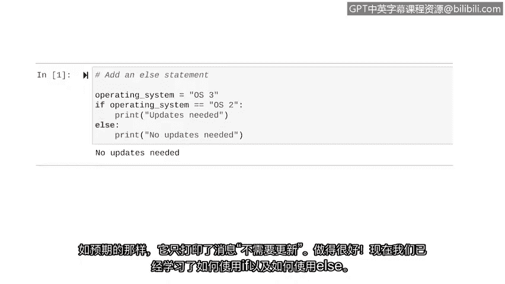

# 009：Python中的条件语句 🐍


在本节课中，我们将要学习Python编程中一个至关重要的概念——**条件语句**。它是实现自动化逻辑的基础，能让你的代码根据不同的情况做出不同的决策。

## 概述

之前，我们讨论了如何在变量中存储不同的数据类型。现在，我们将开始进入**自动化**的概念，以便用代码创建更智能的操作。

**自动化**是利用技术来减少执行常见和重复性任务所需的人工和手动劳动。它允许计算机为我们完成这些任务，从而让我们在生活中腾出更多时间去做其他活动。

**条件语句**对于自动化至关重要。一个条件语句，是一段评估代码以确定其是否满足指定条件的语句。

## 条件语句的核心：`if` 关键字

`if` 关键字在条件语句中非常重要。它用于开始一个条件语句。在这个关键字之后，我们指定必须满足的条件，以及如果条件满足将会发生什么。

我们每天都在使用 `if` 语句。例如：**如果**外面很冷，**那么**我们就穿外套。或者**如果**下雨，**那么**我们就带伞。

`if` 语句的结构包含我们想要评估的条件，以及如果条件满足时Python将执行的操作。Python总是评估条件是**真**还是**假**。如果为真，它就执行特定的操作。

让我们探索一个例子。

## 第一个 `if` 语句示例

我们将指示Python在登录失败尝试次数大于5时，打印一条“账户已锁定”的消息。

```python
if failed_attempts > 5:
    print("Account locked")
```

*   **`if`** 关键字告诉Python开始一个条件语句。
*   之后，我们指明要检查的条件。在这个例子中，我们检查用户的失败登录尝试是否超过5次。注意我们使用了一个名为 `failed_attempts` 的变量。在完整的代码中，我们会在 `if` 语句之前为这个变量赋值。
*   在条件之后，我们总是放置一个冒号 `:`。这表示冒号后面的内容是我们希望在条件满足时发生的事情。
*   在这个例子中，当用户失败登录尝试超过5次时，它会打印“账户已锁定”的消息。
*   在Python中，这行消息必须**至少缩进一个空格**，以确保它只在条件为真时执行。

通常，我们将第一行称为**头部**，而将条件满足时执行的操作称为**主体**。

## 比较运算符

上面的条件是基于一个变量大于一个特定数字。但我们也可以使用各种**运算符**来定义条件。

以下是常用的比较运算符：

*   **小于**：`<`
*   **大于**：`>`
*   **小于或等于**：`<=`
*   **大于或等于**：`>=`
*   **等于**：`==`
*   **不等于**：`!=`

### 特别注意：等于运算符 `==`

当我们在条件语句中检查两个值是否相等时，需要使用特殊的语法：**双等号 `==`**。

双等号是一个重要的运算符，常用于条件语句中。`==` 用于评估两个对象是否匹配。当它们匹配时，结果为布尔值 `True`；不匹配时，结果为 `False`。

### 不等于运算符 `!=`

感叹号后跟等号 `!=` 表示“不等于”的条件。这个运算符评估两个对象是否不同。当它们不匹配时，结果为 `True`；匹配时，结果为 `False`。

## 使用 `==` 的示例

让我们更仔细地研究一个使用双等号的例子。我们将关注一个在特定操作系统运行时打印“需要更新”消息的示例。

```python
if operating_system == "OS2":
    print("Updates needed")
```

这里，我们创建了一个条件，用于检查设备的操作系统是否与标识该操作系统的特定字符串匹配。为此，我们需要在条件中使用双等号。当匹配时，我们的程序将打印“需要更新”的消息。

*   `operating_system` 变量在双等号的左边。
*   字符串 `"OS2"` 在双等号的右边。
*   如果条件评估为 `True`，它将执行下一行缩进的代码中的操作。
*   在这里，如果操作系统是 `OS2`，它将打印“需要更新”。如果为 `False`，则不会打印该消息。

注意这行代码是如何缩进的。这告诉Python该任务依赖于 `if` 语句评估为真。

现在，让我们编写包含此条件的代码并查看结果。

```python
# 首先，为操作系统变量赋值
operating_system = "OS2"

# 然后，编写条件语句
if operating_system == "OS2":
    print("Updates needed")
```

由于我们将 `operating_system` 变量设置为 `"OS2"`，`print` 语句将会执行。运行这段代码，正如预期的那样，它打印了“Updates needed”，因为分配给 `operating_system` 变量的值等于 `"OS2"`。

## 引入 `else` 关键字

有时，我们希望条件语句在我们的第一个条件不成立时，执行另一组指令。在我们的例子中，“不成立”意味着设备运行的操作系统不是 `OS2`。这时，我们需要将 `else` 关键字纳入我们的条件语句中。

`else` 引导一段代码，该段代码仅当条件语句中所有前面的条件都评估为 `False` 时才执行。`else` 语句总是跟在 `if` 语句后面，并以冒号 `:` 结尾。

让我们使用之前的条件语句，并为其添加一个 `else` 语句。

```python
# 这次，变量值不同
operating_system = "OS3"

if operating_system == "OS2":
    print("Updates needed")
else:
    print("No updates needed")
```

我们包含了相同的 `if` 语句。但这次，我们将 `operating_system` 变量设置为包含一个不同的操作系统 `"OS3"`。因为这不符合 `if` 语句条件中的值，所以“需要更新”的消息不会打印。但我们可以添加一个 `else` 语句，告诉它做其他事情。

我们输入 `else` 关键字，后跟冒号 `:`。然后缩进下一行，告诉它打印“无需更新”的消息。

当我们运行这段代码时，它会在 `if` 语句之后处理 `else` 语句。由于我们的 `if` 语句将评估为 `False`，它会继续执行 `else` 指令。运行代码，正如预期，它只打印了消息“No updates needed”。

## 总结

在本节课中，我们一起学习了Python中条件语句的基础知识。



1.  我们了解了**自动化**的概念以及条件语句在其中的作用。
2.  我们学习了如何使用 **`if`** 关键字来创建条件分支，让代码根据条件（`True` 或 `False`）执行不同的操作。
3.  我们认识了各种**比较运算符**，特别是用于判断相等的 **`==`** 和用于判断不相等的 **`!=`**。
4.  最后，我们引入了 **`else`** 关键字，它允许我们在 `if` 条件不满足时，提供一个备选的执行路径。

掌握 `if` 和 `else` 的使用，使你能够在代码中融入逻辑判断，这是编写智能、自动化程序的关键第一步。