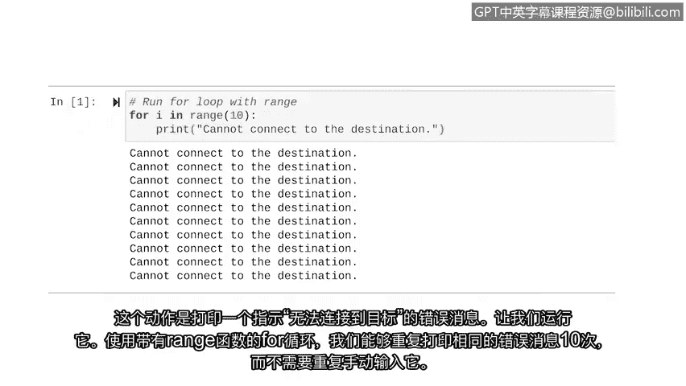

# 010：使用for循环 🔄


## 概述
在本节课中，我们将要学习如何使用迭代语句，特别是**for循环**，来让计算机自动执行重复性任务。我们将了解for循环的语法结构、组成部分，以及如何结合`range`函数来精确控制循环次数。

---

上一节我们介绍了条件语句，它能让计算机做出决策。但有时，我们需要程序简单地计数或一遍又一遍地执行某个任务。

对于人类而言，处理繁琐的任务时容易分心和疲劳。在这种情况下，计算机就显得特别有用。本节中，我们将探讨计算机如何使用迭代语句来执行重复性任务。

迭代语句，也称为**循环**，是一段能重复执行一组指令的代码。设置循环可以让我们重复使用一行代码，而无需多次键入。

在讨论具体语法之前，我们先运行一个循环，让你感受一下它的效果。

```python
for i in [1, 2, 3, 4]:
    print(i)
```
请注意，这段代码仅用一条`print`语句就打印出了列表中的所有数字。这就是循环的作用。

我们将探讨两种类型的循环：**for循环**和**while循环**。我们刚刚运行的就是一个for循环，本节我们将继续重点介绍它。稍后，我们会再探讨while循环。

**for循环**会为指定的序列重复执行代码。一个典型的例子就是使用for循环来打印列表中的每一项。

---

### for循环的结构
for循环以关键字`for`开头。与条件语句类似，迭代语句也由两个主要部分组成：**循环头**和**循环体**。

让我们通过刚才运行的for循环来剖析这些部分。

**循环头**是包含`for`关键字并以冒号结尾的那一行。它告诉Python开始一个循环。循环头由以下部分组成：
*   `for`关键字
*   一个**循环变量**
*   循环将要遍历的**序列**

**循环变量**是一个用于控制循环迭代的变量。它紧跟在`for`后面。一个常见的命名是字母`i`，但你可以给它起任何你想要的名称。在for循环中，这个临时变量只在循环内部使用，不会在代码的其他部分使用。

循环变量后面是`in`操作符，以及循环将要遍历的序列。在我们之前的例子中，这个序列是一个包含数字1到4的列表。循环会让这些数字中的每一个都执行指定的操作。

**请记住**，必须在循环头的末尾加上冒号，以引入后续的代码。

**循环体**指的是循环头之后缩进的行。这些行代表了循环迭代时要重复执行的操作。在我们这个例子中，它将打印列表中的每个数字：先是1，然后是2，依此类推。

---

### 结合`range`函数使用for循环
for循环的另一个重要用途是，将特定过程重复执行设定的次数。这可以通过结合`range`函数来实现。

`range`函数会生成一个数字序列。例如，`range(0, 10)`会设定一个从0开始，一直到9的序列。

当我们使用`range`时，我们从第一个位置的数字开始计数（在这个例子中是0）。当我们到达第二个位置的数字时，它告诉我们停止的位置，**但这个数字本身被排除在外**。所以在这个例子中，数字是10，序列只到9。

关于`range`函数的一个重要细节是：如果我们不提供起始点，它会自动从0开始。`range(10)`中的10代表停止点。由于停止点被排除，序列中包含的数字从0开始，到9结束。一个从0开始到9结束的序列将迭代10次。

让我们运行一个结合了`range`函数的for循环。

```python
for i in range(10):
    print("Cannot connect to the destination.")
```
我们将使用`range(10)`来要求Python重复一个动作10次，然后指明我们想要重复的动作——打印一条“无法连接到目标”的错误信息。

运行这段代码，使用for循环结合`range`函数，我们得以将同一条错误信息重复10次，而无需我们自己一遍又一遍地键入。



---

## 总结
本节课中，我们一起学习了迭代语句的语法和结构，并以**for循环**为例进行了实践。我们了解了循环头和循环体的组成，以及如何利用`range`函数来控制循环的精确次数。在下一节视频中，我们将介绍另一种迭代语句：**while循环**。