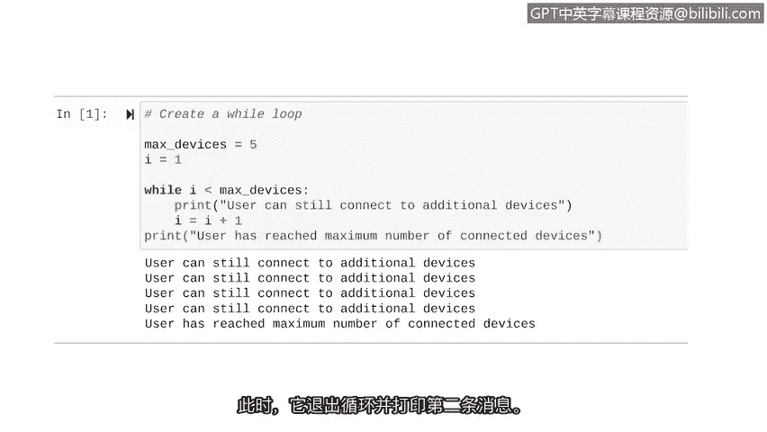
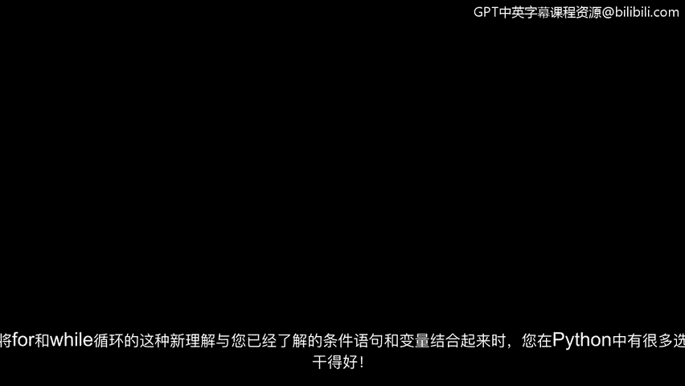

# 011：使用while循环


## 概述
在本节课中，我们将要学习Python中的另一种迭代语句——`while`循环。我们将了解它的基本结构、工作原理，并通过一个网络安全相关的实际例子来掌握其用法。

上一节我们介绍了Python中的迭代语句，并重点讲解了`for`循环。迭代语句是重复执行一组指令的代码。

## while循环基础
本节中我们来看看`while`循环。`while`循环也是一种迭代语句，但它的重复执行是基于一个条件。只要条件为真，循环就会继续执行；当条件变为假时，循环就会停止。

`while`循环的基本结构如下：
```python
while condition:
    # 循环体（要重复执行的代码）
```

与`for`循环不同，`while`循环的头部由关键字`while`、一个条件和一个冒号组成。条件必须是一个布尔表达式（结果为`True`或`False`）。循环变量需要在编写`while`循环之前进行赋值，然后在循环条件中引用它。

例如，以下循环将在变量`time`小于等于10时持续运行：
```python
time = 0
while time <= 10:
    print(time)
    time = time + 2
```
在这个例子中，循环会打印出所有小于等于10的偶数。注意，我们需要在循环体内明确地改变循环变量`time`的值（每次增加2），否则循环可能会无限进行下去。

## 实践案例：监控设备连接数
现在我们已经了解了`while`循环的基础知识，让我们探索一个实际应用场景。想象一下，我们需要限制用户可以连接的设备数量。我们可以使用`while`循环在用户达到最大连接设备数时打印消息。

以下是实现此功能的步骤：

1.  **初始化变量**：在循环开始前，我们需要设置最大设备连接数和循环变量。
2.  **构建循环条件**：循环将一直运行，直到循环变量不小于最大设备数。
3.  **定义循环体**：在循环内部，执行相关操作（例如打印状态信息）并更新循环变量。
4.  **处理循环结束**：循环结束后，执行后续操作。

让我们用代码来实现这个逻辑：
```python
# 1. 初始化变量
max_devices = 5  # 最大连接设备数
i = 1            # 循环变量，表示当前已连接设备数

# 2. & 3. while循环
while i < max_devices:
    print("用户仍可连接更多设备。")
    i = i + 1  # 模拟用户连接了一个新设备

# 4. 循环结束后
print("用户已达到最大连接设备数。")
```
运行这段代码，第一条消息会打印四次。当`i`的值增加到5时，循环条件`i < max_devices`变为假，循环停止，然后打印出第二条消息。

## 总结
本节课中我们一起学习了`while`循环。我们了解到，`while`循环是一种基于条件进行重复执行的迭代语句。它的核心结构是`while condition:`，并且需要在循环体内管理循环变量的变化以避免无限循环。通过一个限制设备连接数的网络安全示例，我们实践了如何应用`while`循环来解决实际问题。





当你将`for`循环、`while`循环的新知识与之前学过的条件语句和变量结合起来时，你在Python中将拥有非常强大的工具来解决各种自动化任务。