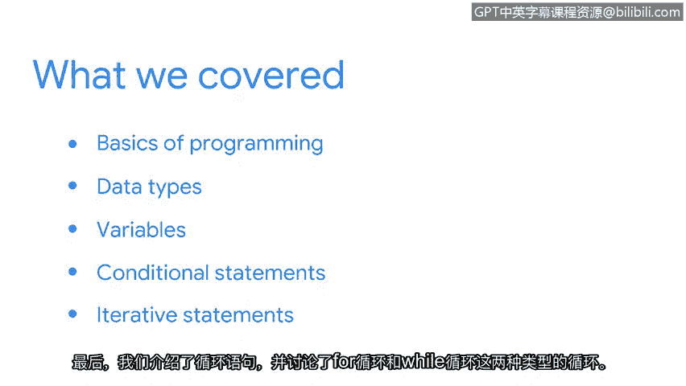

# 012：总结

## 概述
在本节课中，我们学习了安全分析师为何使用Python，以及程序的基本结构。我们甚至解读了一些Python代码行。现在，让我们回顾一下到目前为止所学的内容。

## 课程内容回顾

上一节我们介绍了迭代语句，现在我们来总结整个单元的核心知识点。

以下是本单元涵盖的主要知识点列表：

*   **编程基础与重要性**：你首先学习了编程的基础知识，以及它为何成为安全分析师非常重要的工具。你还了解了一些关于编程语言工作原理的基本概念。
*   **Python数据类型**：接着，你学习了识别Python中的数据类型。我们重点介绍了**字符串**、**整数**、**浮点数**、**布尔值**和**列表**。
*   **变量**：之后，我们重点学习了如何使用**变量**。
*   **条件语句**：然后，你全面了解了**条件语句**，以及如何使用Python语句检查逻辑条件。
*   **迭代语句**：最后，我们学习了**迭代语句**，并讨论了`for`循环和`while`循环这两种循环类型。

## 总结与展望
本节课中，我们一起学习了Python编程的核心基础，包括数据类型、变量、条件判断和循环。这些知识将伴随你继续学习本课程，并在你作为安全分析师的职业生涯中发挥作用。

在接下来的章节中，我们将探索Python的其他重要组成部分，包括**函数**。