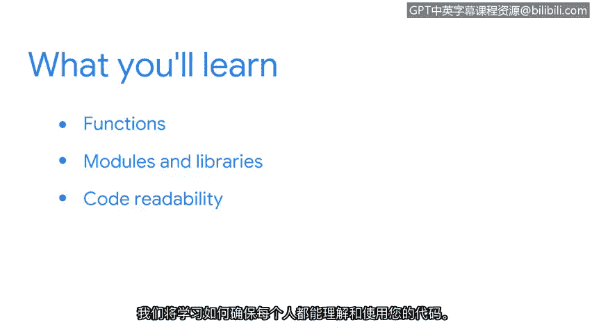

# 013：欢迎来到第二周 🚀

在本节课中，我们将继续Python编程之旅，学习如何编写更高效、更专业的脚本。我们将重点介绍函数、模块与库，以及提升代码可读性的最佳实践。

---

欢迎回到我们的Python学习之旅。在之前的视频中，我们已经学习了Python的所有基础知识。

我们从最基础的部分开始，了解了安全分析师如何使用Python。

我们学习了Python的几个基础构建模块。我们详细学习了数据类型、变量和基本语句。

现在，我们将在此基础上更进一步，学习如何编写更高效的Python脚本。我们将探索如何让我们的工作更有效率。

---

接下来的视频将首先介绍**函数**，这在Python中非常重要。函数允许我们将一组指令组合在一起，以便在代码中反复使用。

之后，我们将学习**Python模块和库**。它们包含了我们可以与Python一起使用的函数和数据类型的集合。它们帮助我们获得现成的函数，而无需我们自己创建。

最后，我们将讨论编程中最重要的规则之一，即**代码可读性**。我们将学习如何确保每个人都能理解并使用你的代码。

---

我很高兴你决定继续与我一起探索Python。那么，让我们开始学习更多内容吧。

---

## 总结

本节课中，我们一起回顾了Python基础，并预告了接下来的学习重点：**函数**、**模块与库**以及**代码可读性**。掌握这些概念将帮助你构建更强大、更易于维护的自动化安全脚本。