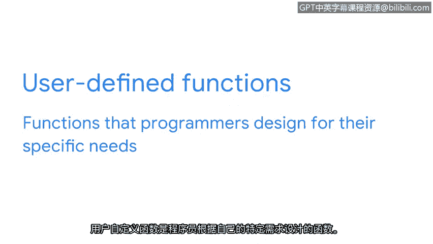

# 014：函数入门

在本节课中，我们将要学习Python编程中的一个核心概念：函数。我们将了解函数是什么、为什么它们如此重要，以及如何在你的代码中使用它们来提高效率和可维护性。

## 概述：什么是函数？

随着程序复杂度的增长，我们很可能会重复使用相同的代码行。多次编写相同的代码会非常耗时。幸运的是，我们有一种方法来管理这种情况：我们可以使用函数。

一个函数是一段可以在程序中重复使用的代码。

## 函数的必要性

我们已经学习过一个函数：当我们使用 `print` 时，我们用它来将指定的数据输出到屏幕。例如，我们打印了 `hello Python`。但Python中还有许多其他函数。

有时，我们需要自动化一个任务，如果手动完成，这个任务可能会变得重复。之前，我们将Python的其他关键组件比作厨房中的元素。我们将数据类型比作食物的类别。我们处理蔬菜和肉的方式不同，同样，我们处理不同数据类型的方式也不同。

我们讨论过变量就像餐后存放食物的容器，它们所容纳的东西可以改变。至于函数，我们可以把它们想象成洗碗机。如果你不使用洗碗机，你将花费大量时间单独清洗每个盘子。但洗碗机自动化了这个过程，让你可以一次性清洗所有东西。类似地，函数提高了效率。它们在程序中执行重复性的活动，并让程序有效地工作。

## 函数的工作原理与优势

函数被设计为在我们的程序中重复使用。它们由小的指令组成，可以在程序中的任何地方被调用任意次数。

函数的另一个好处是，如果我们必须对它们进行更改，我们可以直接在函数中进行修改，这些更改将应用到我们使用该函数的所有地方。这比在程序中的许多不同地方进行相同的更改要好得多。

`print` 函数是一个内置函数的例子。内置函数是存在于Python内部、可以直接调用的函数。它们默认对我们可用。

我们也可以创建自己的函数。用户自定义函数是程序员为其特定需求设计的函数。

## 函数类型总结

上一节我们介绍了函数的基本概念和优势，本节中我们来看看函数的两种主要类型。

以下是两种主要的函数类型：

*   **内置函数**：例如 `print()`，是Python语言自带的，可以直接使用。
*   **用户自定义函数**：由程序员根据特定需求创建的函数。

这两种类型的函数都像是大型程序中的迷你程序。它们使Python工作变得更加有效和高效。

## 总结

本节课中我们一起学习了Python函数的基础知识。我们了解到函数是一段可重用的代码，能够极大地提高编程效率和代码的可维护性。我们探讨了函数的必要性，将其比作自动化任务的“洗碗机”。我们还区分了内置函数和用户自定义函数，认识到它们都是构建有效程序的重要工具。在接下来的课程中，我们将继续深入学习如何创建和使用自定义函数。