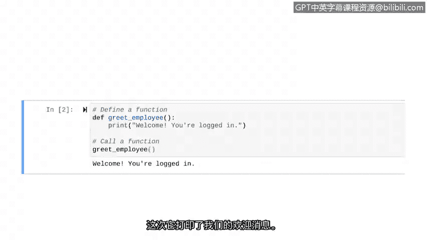

# 015：创建一个基本函数


在本节课中，我们将要学习如何创建和运行一个非常简单的用户自定义函数。我们将从定义函数开始，然后调用它来执行特定的任务。

## 定义函数

上一节我们介绍了用户自定义函数的概念，本节中我们来看看如何具体定义一个函数。定义函数就是告诉Python这个函数的存在。为此，我们需要使用 `def` 关键字。

以下是定义一个函数的基本步骤：

1.  使用 `def` 关键字。
2.  为函数命名。
3.  在函数名后添加括号 `()`。
4.  在行末添加冒号 `:`。
5.  在缩进的代码块中编写函数要执行的语句。

让我们创建一个在员工登录后向其问候的函数。首先，我们通过注释说明代码的意图。

```python
# 定义一个问候员工的函数
def greet_employee():
    print("欢迎登录！")
```

在这段代码中，`def` 是定义函数的关键字，`greet_employee` 是我们为函数起的名字。括号 `()` 目前是空的，因为我们这个简单的函数不需要接收任何外部信息。冒号 `:` 表示函数头的结束，其后的缩进代码 `print("欢迎登录！")` 是函数被调用时会执行的操作。

## 调用函数

仅仅定义函数并不会让它运行。就像我们之前使用过的 `print()` 内置函数一样，我们需要“调用”函数来执行它里面的代码。

以下是调用我们刚刚定义的函数的方法：

```python
# 调用问候员工的函数
greet_employee()
```



当我们运行包含定义和调用的完整代码时，控制台就会输出我们预设的欢迎信息。

## 总结


本节课中我们一起学习了如何创建和运行一个基本的Python函数。我们首先使用 `def` 关键字定义了一个名为 `greet_employee` 的函数，它执行打印欢迎信息的操作。随后，我们通过写出函数名加括号 `greet_employee()` 的方式调用了这个函数，从而成功输出了消息。这是一个简单函数的完整流程。接下来，我们将学习如何让函数变得更复杂和实用。