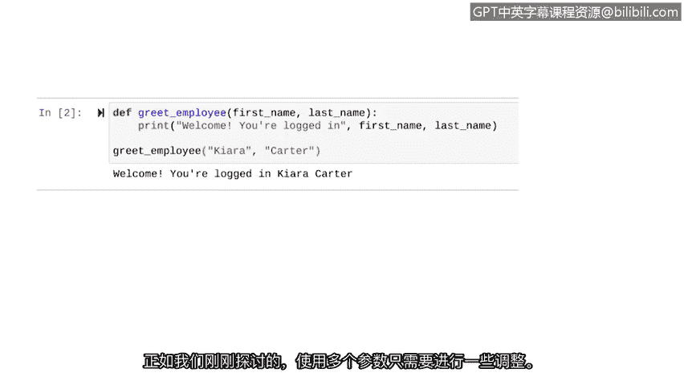

# 016：在函数中使用参数


在本节中，我们将学习如何在Python函数中使用参数。参数允许函数接收外部信息，从而使函数的功能更加灵活和强大。我们将通过定义和调用带参数的函数来掌握这一核心概念。

## 概述

之前，我们定义并调用了第一个函数。那个函数不需要从外部获取任何信息。但其他函数可能需要。这意味着我们需要讨论如何在函数中使用参数。

在Python中，**参数**是包含在函数定义中供该函数内部使用的对象。参数通过函数名后的括号被函数接收。我们在上一个视频中创建的函数没有接收任何参数。

现在，让我们回顾另一个使用参数的函数——`range`函数。如果你还记得，`range`函数会生成一个从起点到终点前一个值的数字序列。因此，`range`函数包含了用于起始和结束索引的参数，每个参数都接受一个整数值。

例如，它可以接受整数3和7。这意味着它生成的序列将从3运行到6。

## 定义带参数的函数

在我们的上一个例子中，我们编写了一个在有人登录时显示欢迎信息的函数。如果我们在信息中加入员工的名字，欢迎效果会更好。

让我们定义一个带参数的函数，以便我们可以按名字问候员工。

当我们定义函数时，我们将包含函数所依赖的参数名称。我们将这个参数（`name`变量）放在括号内。其余的语法保持不变。

```python
def greet_employee(name):
```

现在，让我们转到下一行并缩进，以便告诉Python我们希望这个函数做什么。我们希望打印一条使用传入函数的`name`来欢迎员工的信息。

将变量引入我们的打印语句需要考虑几点。和之前一样，我们从想要打印的欢迎信息开始。但在这种情况下，我们不会在告诉他们已登录后就停止信息。我们希望继续并将员工的名字添加到信息中。

这就是为什么我们在“you are logged in”后面加一个逗号，然后添加`name`变量。由于这是一个变量而不是特定的字符串，我们不用引号括住它。

```python
def greet_employee(name):
    print("Welcome, you are logged in,", name)
```

## 调用函数并传递参数

现在我们的函数已经设置好，我们准备用一个特定的**参数**来调用它。

在Python中，**参数**是在调用函数时带入函数的数据。例如，之前我们将3和7传递给`range`函数，这些就是参数。

在我们的例子中，假设我们想问候一位名叫Charlie Patel的员工。我们将用这个参数调用我们的`greet_employee`函数。

```python
greet_employee("Charlie Patel")
```

当我们运行这段代码时，Charlie Patel会收到一条个性化的欢迎信息。

## 使用多个参数

在这个例子中，我们的函数只有一个参数。但我们也可以有更多参数。让我们探索一个这样的例子。

也许我们不是只有一个`name`参数，而是有一个`first_name`参数和一个`last_name`参数。如果是这样，我们需要像这样调整代码。

首先，当我们定义函数时，我们包含两个参数并用逗号分隔它们。

```python
def greet_employee_fullname(first_name, last_name):
```

然后，当我们调用它时，我们也包含两个参数。这次，我们问候一位名叫Kiara Karu的人。这些参数也用逗号分隔。

```python
greet_employee_fullname("Kiara", "Karu")
```

让我们运行这些代码来欢迎Kiara Karu。正如我们刚刚探索的，使用多个参数只需要进行一些调整。

以下是完整的代码示例：

```python
def greet_employee_fullname(first_name, last_name):
    print("Welcome, you are logged in,", first_name, last_name)

greet_employee_fullname("Kiara", "Karu")
```

## 总结



在本节中，我们一起学习了如何在函数中使用参数。我们了解到参数是函数定义的一部分，用于接收外部数据，而参数是在调用函数时实际传递的数据。我们实践了如何定义带有一个和多个参数的函数，并成功地调用了它们。掌握参数的使用对于编写灵活、可重用的Python脚本至关重要。


本节视频中我们学习了大量关于在函数中使用参数的知识。😊 这种理解在你继续编写Python脚本时将必不可少。