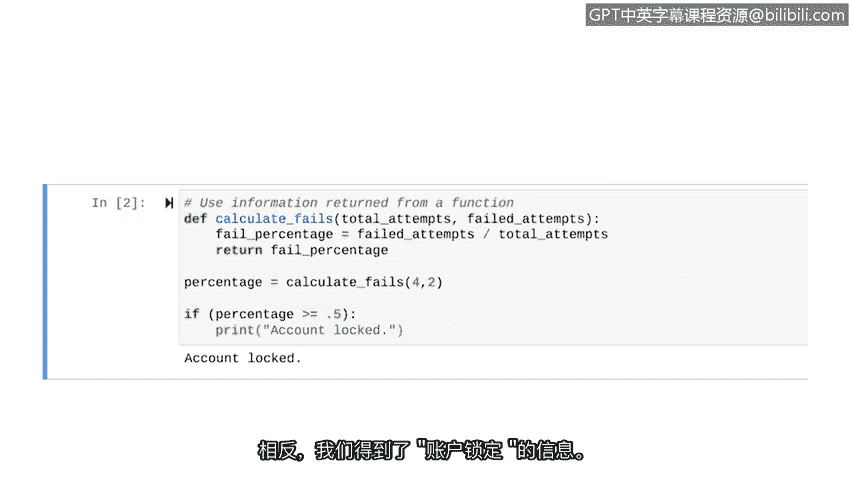

# 017：返回语句


在本节课中，我们将学习如何从函数中返回信息。我们将了解`return`语句的作用，并通过一个计算登录失败率的网络安全相关示例来演示其用法。

## 概述

之前我们学习了如何向函数传递参数。实际上，函数不仅能接收信息，还能向外发送信息。`return`语句使我们能够实现这一点。它是一个在函数内部执行的Python语句，用于将信息发送回函数调用处。对于安全分析师而言，从函数返回信息的能力有多种用途。例如，分析师可能编写一个函数来检查某人是否有权访问特定文件，并向主程序返回一个布尔值（`True`或`False`）。

接下来，我们将探索另一个示例，创建一个与分析登录尝试相关的函数。

## 创建返回信息的函数

上一节我们介绍了如何向函数传递参数，本节中我们来看看如何让函数计算结果并返回给我们。

我们将创建一个函数，根据传入的信息计算登录失败的百分比，并返回这个百分比。程序可以多种方式使用这个信息，例如，决定是否锁定账户。

以下是创建此函数的步骤：

1.  **定义函数**：我们首先定义一个名为`calc_fails`的函数。
2.  **设置参数**：该函数将设置两个与登录尝试相关的参数：`total_attempts`（总尝试次数）和`failed_attempts`（失败次数）。
3.  **计算百分比**：在函数体内，我们将失败次数除以总次数，得到失败百分比，并将其存储在变量`fail_percentage`中。
4.  **使用`return`语句**：最后，我们使用关键字`return`将`fail_percentage`变量的值返回给调用者。

让我们用代码来具体实现：

```python
def calc_fails(total_attempts, failed_attempts):
    fail_percentage = failed_attempts / total_attempts
    return fail_percentage
```

## 调用函数并处理返回值

定义好函数后，我们就可以调用它了。假设一个用户登录了4次，其中2次失败。

直接调用函数`calc_fails(4, 2)`会进行计算并返回值`0.5`（即50%）。但在某些Python环境中，这个返回值可能不会自动显示在屏幕上。

更重要的是，**在函数外部无法直接使用函数内部定义的变量名（如`fail_percentage`）**。为了在程序的其他部分使用这个计算结果，我们需要将函数的返回值赋给一个新的变量。

以下是正确处理返回值的示例：

```python
# 调用函数，并将返回值存储在变量 `percentage` 中
percentage = calc_fails(4, 2)

# 现在可以在后续代码中使用这个变量
if percentage >= 0.5:
    print("账户已锁定")
```

运行这段代码，我们不会直接看到百分比数值被打印出来，而是会根据条件判断输出“账户已锁定”的消息。这演示了如何将函数的返回值集成到更复杂的程序逻辑中。

## 总结

本节课中我们一起学习了`return`语句。我们了解到，`return`关键字用于从函数中返回信息，这使得函数不仅能执行任务，还能输出结果供程序其他部分使用。我们通过一个计算登录失败率并据此决定是否锁定账户的网络安全示例，实践了如何定义返回值的函数以及如何接收和使用返回值。

---




接下来，我们将讨论更多关于函数的内容。不过下一次，我们将重点介绍一些Python内置的、可以直接使用的函数。