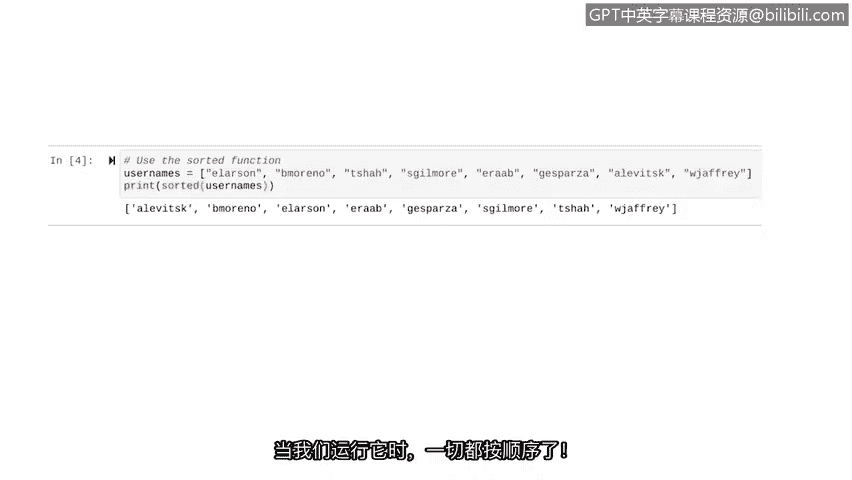

# 018：探索内置函数 🐍


在本节课中，我们将要学习Python的内置函数。我们将回顾一些已学过的函数，并探索几个新的内置函数，了解它们的输入、输出以及如何组合使用它们。

## 回顾已学的内置函数

上一节我们学习了如何创建自定义函数。本节中，我们来看看Python提供的一些内置函数。

内置函数是Python中预先定义好的函数，我们可以直接调用它们。我们只需要知道它们的名称即可。在之前的课程中，我们已经接触过两个内置函数：`print` 和 `type`。让我们快速回顾一下。

*   **`print` 函数**：将指定的对象输出到屏幕。
*   **`type` 函数**：返回其输入参数的数据类型。

## 组合使用函数

之前，我们通常是独立地使用这些函数。例如，单独调用 `print` 或 `type`。随着我们开始深入学习函数，经常需要将多个函数组合在一起使用。

我们可以通过将一个函数作为参数传递给另一个函数来实现这一点。例如，在下面这行代码中：

```python
print(type("hello"))
```

Python首先会执行内部的 `type("hello")`，返回字符串 `"hello"` 的数据类型（`<class 'str'>`）。然后，这个返回值会作为参数传递给外层的 `print` 函数。最终，字符串的数据类型会被打印到屏幕上。

`print` 和 `type` 并不是唯一可以这样组合使用的函数。在所有情况下，其通用语法是相同的：**先处理内部函数，然后将其返回值传递给外部函数**。

## 理解函数的输入与输出

使用函数时，必须理解它们期望的输入和产生的输出。

有些函数只接受特定的数据类型，如果使用错误类型，会返回类型错误。另一些函数可能需要特定数量的参数，或者会返回不同类型的数据。

以下是关于 `print` 和 `type` 函数输入输出的分析：

*   **`print` 函数**：可以接受任何数据类型作为输入，也可以接受任意数量的参数，即使这些参数的数据类型各不相同。
*   **`type` 函数**：可以接受所有数据类型，但它只接受一个参数。

让我们通过代码来探索 `print` 函数的输入和输出。我们将传入三个参数：

```python
print("The number is", 2023, ".")
```

运行这段代码，它会按预期打印出所有内容。

现在，让我们探索 `type` 函数的输入和输出：

```python
print(type("security"))
print(type(73.2))
```

运行这段代码，Python首先告诉我们单词 `"security"` 是字符串类型，接着告诉我们 `73.2` 是浮点数类型。

在使用内置函数之前，我们必须确切知道它需要多少个参数、参数可以是哪些数据类型，以及它会产生什么样的输出。

## 学习新的内置函数

了解了这些注意事项后，让我们来学习两个新的内置函数。

### `max` 函数

`max` 函数返回传入的数值参数中的最大值。它没有定义可接受参数的具体数量。

以下是使用 `max` 函数的示例：

```python
a = 3
b = 9
c = 6
print(max(a, b, c))
```

运行这段代码，它会告诉我们这些值中最大的是 `9`。

### `sorted` 函数

`sorted` 函数对列表中的元素进行排序。在网络安全场景中处理列表时，这个函数非常有用。

对于数字列表，我们可以将其从小到大（或从大到小）排序。对于字符串列表，我们可能需要按字母顺序排序。例如，假设你有一个包含组织中用户名的列表，并且你想按字母顺序对其进行排序。

让我们使用Python的 `sorted` 函数来实现：

```python
usernames = ["zkeller", "wjaffrey", "ptran", "dnguyen"]
print(sorted(usernames))
```



运行这段代码，所有用户名现在都按字母顺序排列好了。

## 总结


本节课中，我们一起学习了Python的内置函数。我们回顾了 `print` 和 `type` 函数，并学习了如何通过将一个函数嵌套在另一个函数中来组合使用它们。我们还探讨了理解函数输入和输出的重要性。最后，我们介绍了两个新的内置函数：用于查找最大值的 `max` 函数，以及用于对列表进行排序的 `sorted` 函数。这些只是Python众多内置函数中的一小部分，随着你在Python中深入实践，你会熟悉更多能在程序中帮助你的函数。