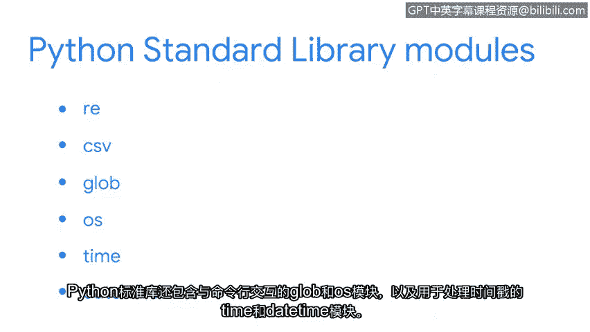

# 019：模块与库

## 概述
在本节课中，我们将要学习Python中的模块与库。它们是包含预编写代码的文件集合，能帮助我们更高效地完成编程任务，特别是在处理网络安全相关的数据分析时。

## 从函数到模块
上一节我们介绍了如何在Python中构建和使用函数。Python自带了许多内置函数，例如 `print()`、`type()` 和 `max()`。

为了使用更多预先编写好的功能，我们可以导入库。库是模块的集合，为程序提供了可访问的额外代码。

## 理解模块与库
所有库通常由多个模块组成。模块是一个Python文件，其中包含额外的函数、变量、类以及任何可运行的代码。你可以将它们视为保存了有用功能的Python文件。

模块的代码可能简短，也可能复杂冗长。无论如何，它们都能帮助程序员节省时间，并使代码更具可读性。

## Python标准库
现在，让我们具体关注Python标准库。它是一个庞大的、可用的Python代码集合，通常随Python一起安装。

以下是Python标准库中的几个模块示例：

*   **`re` 模块**：这是一个对安全分析师非常有用的模块，当需要搜索日志文件中的模式时可以使用它。
*   **`csv` 模块**：它允许你高效地处理CSV文件。
*   **`sys` 和 `os` 模块**：用于与命令行交互。
*   **`time` 和 `datetime` 模块**：用于处理时间戳。

这些只是Python标准库中的一小部分模块。

## 外部库
除了Python标准库中始终可用的内容，你还可以下载外部库。以下是两个例子：

*   **`beautifulsoup4`**：用于解析HTML网页文件。
*   **`numpy`**：用于数组和数学计算。

这些库将协助你作为安全分析师进行网络流量分析、日志文件解析和复杂数学运算。

## 总结
本节课中我们一起学习了Python的模块与库。总的来说，Python库和模块非常有用，因为它们提供了预先编程好的函数和变量，这为用户节省了大量时间。我们鼓励你探索我们在这里讨论的一些库和模块，并思考它们在你使用Python工作时可能带来的帮助。