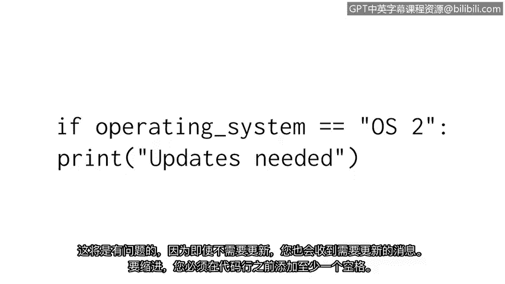

# 020：代码可读性


在本节课中，我们将要学习如何编写易于阅读和维护的Python代码。我们将探讨代码可读性的重要性，并介绍一些关键的指导原则，特别是PEP 8风格指南。

## 概述：为什么代码可读性很重要

编写代码不仅是为了让计算机执行，更是为了让其他人（包括未来的自己）能够理解。Python因其可读性强而广受欢迎，而遵循社区公认的风格指南能确保代码的整洁和一致。

## 代码风格指南

上一节我们介绍了代码可读性的基本概念，本节中我们来看看什么是风格指南。

风格指南是一份手册，用于指导文档的编写、格式和设计。在编程领域，风格指南旨在帮助程序员遵循相似的约定。

**PEP 8** 是为Python程序员提供的风格指南资源。PEP是“Python增强提案”的缩写。PEP 8为程序员提供了与语法相关的建议。这些建议不是强制性的，但它们有助于在程序员之间建立一致性，确保其他人能轻松理解我们的代码。其核心原则是：**代码被阅读的次数远多于被编写的次数**。

对于任何希望以与其他程序员一致的方式风格化和格式化其Python代码的人来说，PEP 8都是一个极好的资源。

## 注释

PEP 8讨论了注释的使用。注释是程序员对其代码意图所做的说明。它们被插入到计算机程序中，以指示代码在做什么以及为什么这样做。

以下是PEP 8的一些具体建议：
*   使你的注释清晰明了。
*   当代码更改时，保持注释的更新。

以下是一个没有注释的代码示例：
```python
failed_attempts = 6
if failed_attempts > 5:
    print(“Account locked”)
```
编写这段代码的人可能知道发生了什么，但其他需要阅读它的人呢？他们可能不理解 `failed_attempts` 变量背后的上下文，以及为什么当它大于5时会打印“Account locked”。即使原作者将来为了开发更大的程序而需要重新审视这段代码，没有注释也会降低效率。

在这个例子中，我们添加了注释：
```python
# 检查登录失败次数，超过5次则锁定账户
failed_attempts = 6
if failed_attempts > 5:
    print(“Account locked”)
```
现在，其他读者可以快速理解我们的程序及其变量在做什么。注释应该简短且切中要点。

## 缩进

接下来，让我们谈谈代码可读性的另一个重要方面：缩进。

缩进是在一行代码开头添加的空格。这既能提高可读性，又能确保代码正确执行。在某些情况下，你必须缩进行代码以建立与其他行代码的连接。这些缩进的代码行组成一个代码块，并与前面未缩进的行代码建立联系。



条件语句的主体就是一个例子：
```python
updates_needed = True
if updates_needed:
    print(“System updates are required.”)
```
我们需要确保 `print` 语句仅在条件满足时执行。这里的缩进为Python提供了这个指令。如果 `print` 语句没有缩进，Python将在条件语句之外执行它，导致它总是被打印。这将产生问题，因为你会收到一条需要更新的消息，即使实际上并不需要。

要进行缩进，你必须在代码行前添加至少一个空格。通常，程序员为了视觉清晰会添加两到四个空格。PEP 8指南建议使用四个空格。

## 实践中的重要性

在我的第一份工程工作中，我编写了一个脚本来帮助验证和启动防火墙规则。起初，我的脚本运行良好，但一年后当我们试图扩展其功能时，它变得难以阅读。在那一年里，我的编程知识和编码风格以及我队友的编码实践都发生了变化。当时我们的组织没有使用编码风格指南，所以我们的代码差异很大，难以阅读，并且扩展性不好。这带来了很多挑战，需要额外的工作来修复。

确保代码可读且能够随时间修改，这就是为什么安全专业人员遵循编码风格指南很重要，也是为什么风格指南对组织来说如此重要。

## 总结

在本节课中，我们一起学习了Python代码可读性的关键要素。我们了解了PEP 8风格指南的作用，学习了如何编写清晰的注释，以及如何使用正确的缩进来组织代码结构。编写可读的代码是使用Python进行工作的关键能力。

随着我们进入课程的下一部分，我们将继续培养有效的编码实践，以追求更好的可读性。