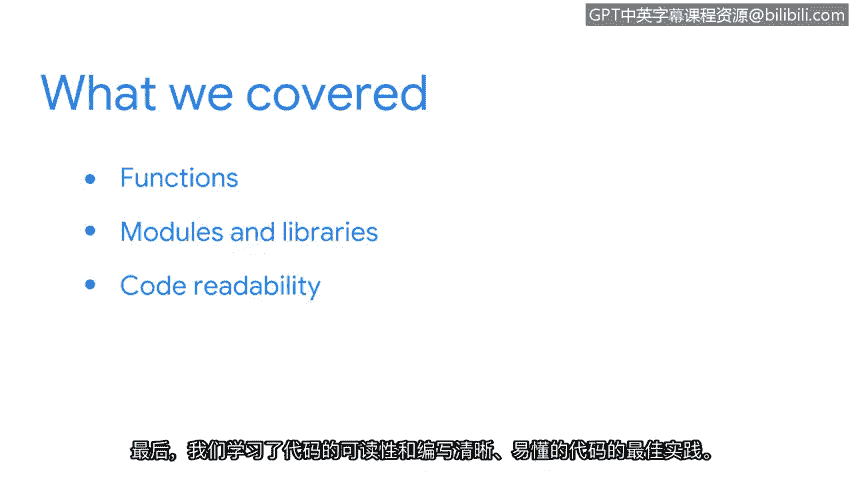

# 022：总结


在本节课中，我们将回顾并总结你在Python课程中学到的核心概念。你已经投入了大量精力来学习如何高效地使用Python，现在让我们快速重温一下这些关键知识点。

## 🧩 核心概念回顾

上一节我们介绍了代码可读性和最佳实践，本节中我们来整体回顾整个课程的核心内容。

以下是你在本阶段课程中学到的三个主要部分：

1.  **函数的作用**
    你首先理解了函数在Python中的角色。函数可以节省大量时间。你学习了如何构建函数，以及如何开发自定义函数来满足特定需求。定义一个函数的基本语法是：
    ```python
    def function_name(parameters):
        # 函数体
        return result
    ```

2.  **模块与库**
    随后，我们的焦点转向了模块和库。它们让你能够访问比Python内置函数多得多的功能。你可以使用 `import` 语句来引入它们：
    ```python
    import module_name
    from library import specific_function
    ```

3.  **代码可读性与最佳实践**
    最后，我们学习了代码可读性和编写清晰、易懂代码的最佳实践。这包括使用有意义的变量名、添加注释以及保持一致的代码风格。

## 🚀 展望未来



掌握了这些知识后，你已经为学习Python在任务自动化方面的强大能力做好了准备。你将进一步了解它如何能帮助你在未来成为一名安全分析师。

感谢你花时间与我一起完成这门课程。我们将在接下来的视频中再见。😊

---

**本节课中我们一起学习了**：Python函数的基础、模块与库的使用，以及编写可读性高、符合最佳实践的代码。这些是使用Python进行高效自动化，特别是网络安全任务自动化的基石。