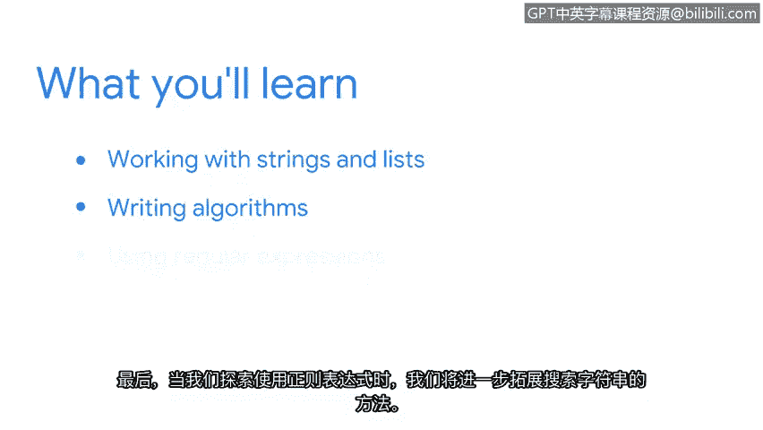

# 023：欢迎来到第三周 🚀

在本节课中，我们将学习如何更高效地处理网络安全工作中的数据。我们将深入探索字符串和列表的操作，学习编写解决安全问题的算法，并初步接触强大的正则表达式工具。

作为一名安全分析师，你将处理大量数据。能够开发管理这些数据的解决方案非常重要。我们即将在Python中学到的内容将对此大有裨益。

在上一节中，我们为本章节的学习打下了基础。我们学习了所有关于数据类型和变量的知识，也涵盖了条件语句和循环语句。我们还学习了如何构建函数，甚至创建了自己的函数。

本节中，我们将在几个不同的方面继续深入。

首先，你将学习更多关于处理字符串和列表的知识。我们将扩展你处理这些数据类型的方式，包括从字符串中提取字符或从列表中提取项目。

我们的下一个重点是编写算法。你将学习一套可以在Python中应用的规则，以解决与安全相关的问题。

最后，在探索使用正则表达式时，我们将进一步扩展搜索字符串的方法。

我们将有很多乐趣，并开始编写一些真正有趣的Python代码。😊

我迫不及待要开始了。

---

本节课中，我们一起学习了第三周的学习目标和内容概览。我们明确了本周将重点提升数据处理能力，包括更高级的字符串和列表操作、算法编写以及正则表达式的引入，这些都是自动化网络安全任务的核心技能。