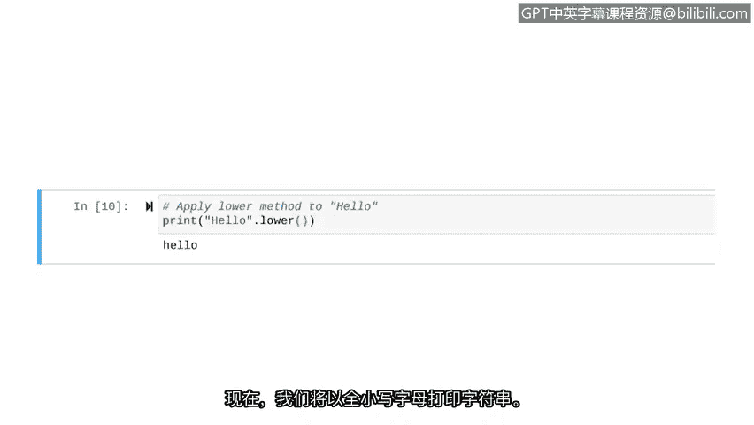

# 024：字符串操作


## 概述

在本节课中，我们将学习如何在Python中处理字符串数据。字符串操作是网络安全任务中的一项基础且重要的技能，例如分析用户名模式或验证IP地址格式。我们将从字符串的基础知识开始，逐步介绍如何创建字符串、获取其长度、连接字符串以及使用字符串方法。

## 字符串基础回顾

上一节我们介绍了Python中的基本数据类型。本节中，我们来看看字符串类型。

字符串是由字符组成的序列数据。在Python中，字符串写在引号内，可以使用单引号或双引号。本课程中我们主要使用双引号。

**示例：**
```python
"hello"
"1,2,3"
"number one"
```

变量可以用于存储字符串。
```python
my_string = "security"
```

## 数据类型转换

有时我们需要将其他数据类型（如整数或浮点数）转换为字符串。为此，我们引入一个新的内置函数：`str()` 函数。

`str()` 函数将输入对象转换为字符串。将对象转换为字符串后，我们可以执行一些仅适用于字符串的操作，例如删除或重新排序其中的字符，这些操作对于整数数据类型来说很困难。

**示例：将整数转换为字符串**
```python
new_string = str(123)
print(type(new_string))
```
运行上述代码，`new_string` 变量将包含字符串 `"123"`，`type()` 函数会确认其类型为字符串。

## 基本字符串操作

现在我们已经知道如何创建和存储字符串，接下来让我们探索一些基本的字符串操作。

### 获取字符串长度

`len()` 函数返回对象中元素的数量。对字符串使用此函数可以告诉我们字符串包含多少个字符。

在网络安全中，此功能很有用。例如，IPv4地址最多有15个字符。安全专业人员可以使用 `len()` 函数来检查一个IPv4地址是否有效：如果其长度超过15个字符，则可以判定为无效的IPv4地址。

**示例：获取字符串长度**
```python
print(len("hello"))
```
运行代码，输出为 `5`，对应单词 “hello” 中的五个字母。

### 字符串连接

我们可以对字符串使用加法运算符，这称为字符串连接。字符串连接是将两个字符串合并在一起的过程。

**示例：连接字符串**
```python
print("hello" + "world")
```
运行后，我们得到 `helloworld`。请注意，两个字符串之间没有自动添加空格。

需要注意的是，并非所有运算符都适用于字符串。例如，不能使用减号来“减去”两个字符串。

## 字符串方法

方法是属于特定数据类型的函数。因此，在另一种数据类型（如整数）上使用字符串方法会导致错误。与其他函数不同，方法出现在字符串之后。

以下是两种常见的字符串方法：

### `upper()` 方法

`upper()` 方法返回一个所有字母均为大写的新字符串副本。

**示例：使用 upper() 方法**
```python
print("hello".upper())
```
注意方法的独特语法：在字符串 `"hello"` 后加一个点 `.`，然后指定要使用的方法 `upper()`。运行后，屏幕输出 `HELLO`。

### `lower()` 方法

`lower()` 方法返回一个所有字母均为小写的新字符串副本。

**示例：使用 lower() 方法**
```python
print("HELLO".lower())
```
将字符串和方法放在 `print()` 函数中以输出结果。运行后，屏幕输出 `hello`。

## 总结



本节课中，我们一起学习了Python中字符串操作的基础知识。我们回顾了字符串的定义和创建方式，学习了如何使用 `str()` 函数进行类型转换。接着，我们探索了如何用 `len()` 函数获取字符串长度，以及如何使用 `+` 运算符进行字符串连接。最后，我们介绍了字符串方法，特别是 `upper()` 和 `lower()` 方法的使用。掌握这些基础操作是进行更复杂字符串处理（如索引和分割）的重要前提。在接下来的课程中，我们将继续深入学习字符串的更多功能。