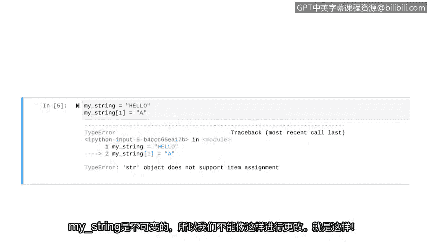

# 025：Python中的字符串索引和切片


## 概述
在本节课中，我们将要学习Python中字符串的索引和切片操作。这些是处理文本数据的基础技能，对于网络安全分析师来说至关重要，例如在日志文件中搜索特定信息。

---

## 字符串索引
上一节我们介绍了字符串处理的重要性。本节中我们来看看如何定位字符串中的单个字符。

在Python中，字符串中的每个字符都有一个对应的索引，用于指示其位置。索引从0开始计数。

**公式**：`字符串[索引]`

例如，字符串 `"hello"` 的索引分配如下：
*   `"h"` 的索引是 `0`
*   `"e"` 的索引是 `1`
*   `"l"` 的索引是 `2`
*   `"l"` 的索引是 `3`
*   `"o"` 的索引是 `4`

在代码中，我们可以通过将索引放在方括号 `[]` 中来访问特定位置的字符。

```python
my_string = "hello"
print(my_string[1])  # 输出: e
```

---

## 字符串切片
了解了如何访问单个字符后，我们来看看如何提取字符串的一部分，这称为切片。

切片允许我们通过指定起始和结束索引来获取一个子字符串。起始索引包含在结果中，而结束索引不包含在结果中。

**公式**：`字符串[起始索引:结束索引]`

例如，要从 `"hello"` 中提取 `"ell"`，我们需要从索引 `1` 开始，到索引 `4` 之前结束。

```python
my_string = "hello"
print(my_string[1:4])  # 输出: ell
```

---

## 使用 `index()` 方法搜索字符串
作为网络安全分析师，我们经常需要在字符串中搜索特定内容。Python提供了 `index()` 方法来帮助我们。

`index()` 方法用于查找某个子字符串或字符在字符串中**第一次出现**的位置，并返回其索引。

以下是 `index()` 方法的使用步骤：
1.  在目标字符串后调用 `.index()` 方法。
2.  将要查找的字符或子字符串作为参数传入。

```python
my_string = "hello"
position = my_string.index("e")
print(position)  # 输出: 1
```

需要注意的是，字符串在Python中是区分大小写的。同时，如果字符重复出现，`index()` 方法只返回第一次出现的位置。

```python
my_string = "hello"
position = my_string.index("l")
print(position)  # 输出: 2 (第二个 ‘l’ 的索引是 3，但不会被返回)
```

---

## 字符串的不可变性
在探讨了如何查找和提取字符串内容后，我们需要了解字符串的一个重要特性：不可变性。

在Python中，**不可变**意味着一个对象在创建并被赋值后，其内容不能被改变。

让我们通过一个例子来理解。尝试直接修改字符串中的某个字符会导致错误。

```python
my_string = "hello"
# 尝试将 ‘e’ 改为 ‘a’
my_string[1] = "a"  # 这行代码会引发 TypeError 错误
```



以上操作会失败，因为字符串 `my_string` 是不可变的。你不能像修改列表元素那样直接通过索引来修改字符串中的字符。

---


## 总结
本节课中我们一起学习了Python字符串处理的核心操作。我们掌握了如何使用索引访问单个字符，如何使用切片提取子字符串，以及如何利用 `index()` 方法在字符串中搜索内容。最后，我们理解了字符串的不可变性，即字符串一旦创建就不能直接修改其内容。这些基础知识是后续进行更复杂文本分析和日志处理的关键。接下来，我们将学习列表的操作，并会发现列表是可变的，这与字符串不同。