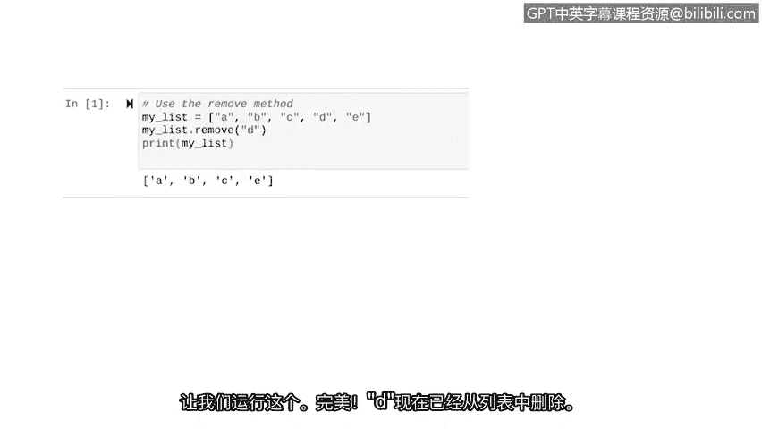

# 026：Python中的列表操作 📋


## 概述
在本节课中，我们将学习Python中列表（List）这一重要数据类型。列表允许我们在单个变量中存储多个数据项，这在网络安全领域非常实用，例如管理IP地址列表或记录被阻止的应用程序。我们将探讨如何创建列表、访问元素、修改列表内容以及使用相关方法。

---

## 列表的创建与访问

上一节我们介绍了字符串，本节中我们来看看另一种数据类型——列表。

列表非常有用，因为它允许你在单个变量中存储多个数据片段。在安全领域，你会处理各种列表。例如，你可能有一个记录有权访问网络的IP地址列表，另一个列表可能包含系统上被阻止运行的应用程序信息。

让我们回顾如何在Python中创建列表。以下代码创建了一个包含字母A到E的列表：
```python
my_list = ['A', 'B', 'C', 'D', 'E']
```
列表中的项目用逗号分隔，并用方括号包围。我们可以将列表赋值给一个变量以便后续使用，这里我们将变量命名为`my_list`。

访问列表中的特定元素时，我们使用的语法与访问字符串中的元素类似。我们将索引值放在存储列表的变量名后面的方括号中。例如，`my_list[1]`将访问列表中的第二个项目。这是因为在Python中，元素的计数从0开始，而不是1。因此，第一个元素的索引是0，第二个元素的索引是1。

让我们尝试从列表中提取一些元素。我们将通过变量名后加`[1]`来提取第二个元素，并将其放入`print`函数以输出结果：
```python
print(my_list[1])
```
运行后，Python会输出字母`B`。

---

## 列表的拼接

与字符串类似，我们也可以使用加号`+`来拼接列表。列表拼接是将两个列表合并为一个，方法是将第二个列表的元素直接放在第一个列表的元素之后。

让我们在Python中实践一下。首先，我们定义与之前示例相同的列表，存储在变量`my_list`中。然后，我们定义另一个包含数字1到4的列表`another_list`。最后，我们用加号拼接这两个列表并打印结果：
```python
my_list = ['A', 'B', 'C', 'D', 'E']
another_list = [1, 2, 3, 4]
concatenated_list = my_list + another_list
print(concatenated_list)
```
运行后，我们会得到一个拼接后的最终列表。

---

## 列表与字符串的区别

在讨论了相似之处后，现在我们来探索列表和字符串之间的区别。

我们之前提到字符串是不可变的，这意味着一旦定义，它们就不能被更改。而列表则没有这个属性，我们可以自由地更改、添加和删除列表中的值。例如，如果我们有一个恶意IP地址列表，那么每当识别出新的恶意IP地址时，我们可以轻松地将其添加到列表中。

首先，让我们尝试在Python中更改列表中的特定元素。我们从前面的示例中的列表开始。要更改列表中的元素，我们需要结合使用方括号表示法和变量赋值。

假设我们要将`my_list`中的第二个元素（字符串`'B'`）更改为数字`7`：
```python
my_list[1] = 7
print(my_list)
```
我们将要更改的对象放在变量赋值的左侧，这里我们更改`my_list`的第二个元素。然后，我们放置一个等号表示我们正在重新分配列表的这个元素。最后，在右侧放置要替换的新对象。运行代码后，字母`B`现在已更改为数字`7`。

---

## 列表元素的插入与移除

现在，让我们看看在列表中插入和移除元素的方法。本视频中我们将使用的第一个方法是`insert`方法。

`insert`方法在列表的特定位置添加一个元素。该方法接受两个参数：第一个是我们要添加元素的位置，第二个是我们要添加的元素。

让我们使用`insert`方法。我们从`my_list`变量中定义的列表开始。然后，我们输入`my_list.insert()`并传入两个参数。第一个参数是我们想要插入新信息的位置，这里我们想插入到索引1处。第二个参数是我们想要添加到列表中的信息，这里是整数`7`：
```python
my_list = ['A', 'B', 'C', 'D', 'E']
my_list.insert(1, 7)
print(my_list)
```
我们的列表仍然以`A`（索引为0的元素）开始。现在，我们在下一个位置（索引为1）有了整数`7`。注意，原本在索引1处的字母`B`并没有像使用方括号表示法时那样被替换。使用`insert`方法时，索引1之后的所有元素都简单地向下移动了一个位置，`B`的索引现在变成了2。

有时我们可能想从列表中移除不再需要的元素。为此，我们可以使用`remove`方法。`remove`方法移除列表中第一次出现的特定元素。与`insert`不同，`remove`的参数不是索引值，而是直接键入你想要移除的元素。`remove`方法会移除列表中该元素的第一个实例。

让我们使用`remove`方法从列表中删除字母`D`：
```python
my_list.remove('D')
print(my_list)
```
我们将变量名`my_list`与`remove`方法结合使用，并将`'D'`作为参数传入。运行后，`D`已从列表中移除。

---



## 总结

本节课中我们一起学习了Python列表的基本操作。我们了解了如何创建和访问列表元素，掌握了列表拼接的方法，并重点探讨了列表与字符串的关键区别——列表的可变性。通过`insert`和`remove`方法，我们学会了如何在列表中动态地添加和删除元素。就像处理字符串一样，能够熟练搜索和操作列表是安全分析师的一项必备技能。我们期待在接下来的课程中继续扩展对这些概念的理解。😊