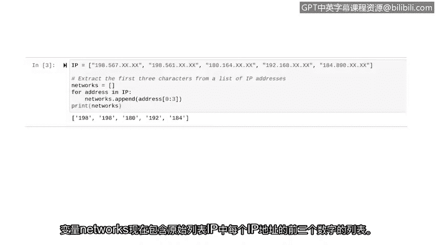

# 027：编写一个简单的算法


## 概述
在本节课中，我们将学习算法的基本概念，并通过一个网络安全领域的实际例子——从IP地址列表中提取网络前缀——来演示如何用Python设计和实现一个简单的算法。我们将结合循环、列表和字符串切片等已学知识。

---

## 什么是算法？🤔
在日常生活中，我们经常遵循规则来解决问题。一个简单的例子是煮咖啡。如果你煮过很多次咖啡，你可能会遵循一个流程：首先，拿起你最喜欢的杯子；然后，将水倒入咖啡机并加入咖啡粉；接着，按下开始按钮并等待几分钟；最后，享受你的新鲜咖啡。

即使你煮咖啡的方法不同或者根本不喝咖啡，你很可能也遵循一套规则来完成类似的日常任务。当你完成这些常规任务时，你就是在遵循一个**算法**。

**算法**是一套用于解决问题的规则。更详细地说，算法是一系列步骤，它从问题中获取输入，利用这个输入执行任务，并返回一个解决方案作为输出。

---

## 网络安全场景：提取IP地址的网络前缀
上一节我们介绍了算法的概念，本节中我们来看看如何将其应用于网络安全任务。假设你是一名安全分析师，手头有一个IP地址列表。你想提取每个IP地址的前三位数字，这将告诉你这些IP地址所属网络的信息。

为了实现这个目标，我们将编写一个算法，其中会用到我们目前学过的多个Python概念：**循环**、**列表**和**字符串**。

以下是存储为字符串的IP地址列表（出于隐私考虑，示例中不显示完整地址）：
```python
IP = ["198.168.1.1", "192.168.2.1", "10.0.0.1"]
```
我们的目标是提取每个地址的前三个数字，并将它们存储在一个新列表中。

---

## 分解问题：从简单情况入手
在编写任何Python代码之前，让我们先分解一下用算法解决这个问题的思路。如果你只有一个IP地址，而不是整个列表，问题会变得简单得多。

**第一步**是使用**字符串切片**从一个IP地址中提取前三位数字。

现在，考虑如何将其应用于整个列表。**第二步**是使用**循环**将该解决方案应用于列表中的每个IP地址。

---

## 实现第一步：字符串切片
之前我们学习过字符串切片。现在，让我们写一些Python代码来解决一个IP地址的问题。

我们从以“198.567”开头的一个IP地址开始，编写几行代码来提取前三个字符：
```python
address = "198.567.xxx.xxx"
print(address[0:3])
```
我们使用方括号表示法来切片字符串。在`print`语句中，`address`变量包含我们要切片的IP地址。请记住，Python从0开始计数，所以要获取前三个字符，我们从索引0开始切片，一直到索引3。Python会排除最终索引，换句话说，它将返回索引0、1和2处的字符。

运行这段代码，我们得到地址的前三位数字：`198`。

---

## 引入新工具：`append`方法
现在我们已经能够解决一个IP地址的问题，我们可以将这段代码放入循环中，并将其应用于原始列表中的所有IP地址。

在这样做之前，我们先介绍一个将在这段代码中使用的方法：`append`方法。`append`方法将输入添加到列表的末尾。

例如，假设`my_list`包含`[1, 2, 3]`，使用以下代码，我们可以用`append`方法将`4`添加到这个列表中：
```python
my_list = [1, 2, 3]
my_list.append(4)
print(my_list)  # 输出: [1, 2, 3, 4]
```

---

## 实现第二步：循环应用
现在我们准备好从列表的每个元素中提取前三个字符了。

首先，我们给定IP列表：
```python
IP = ["198.168.1.1", "192.168.2.1", "10.0.0.1"]
```
创建一个空列表来存储从IP列表中提取的每个地址的前三个字符：
```python
networks = []
```
现在我们可以开始`for`循环了。让我们分解一下：
```python
for address in IP:
    networks.append(address[0:3])
```
`for`告诉Python我们即将开始一个`for`循环。然后我们选择`address`作为循环内的变量，并指定名为`IP`的列表作为可迭代对象。当循环运行时，`IP`列表中的每个元素将临时存储在`address`变量中。

在`for`循环内部，我们有一行代码将`address`的切片添加到`networks`列表中。分解来看，我们使用之前编写的代码来获取IP地址的前三个字符，然后使用`append`方法将一个项目添加到列表的末尾。在这里，我们添加到`networks`列表。



最后，让我们打印`networks`列表并运行代码：
```python
print(networks)
```
运行后，变量`networks`现在包含了原始`IP`列表中每个IP地址前三位数字的列表。

---


## 总结
本节课中我们一起学习了算法的定义，并通过一个提取IP地址网络前缀的实例，实践了如何将复杂问题分解为更小的步骤。我们首先使用字符串切片处理单个元素，然后利用`for`循环和`append`方法将解决方案扩展到整个列表。设计算法可能具有挑战性，因此在着手编写代码之前将其分解成小问题是一个好方法。我们将在后续视频中继续练习这一思想。