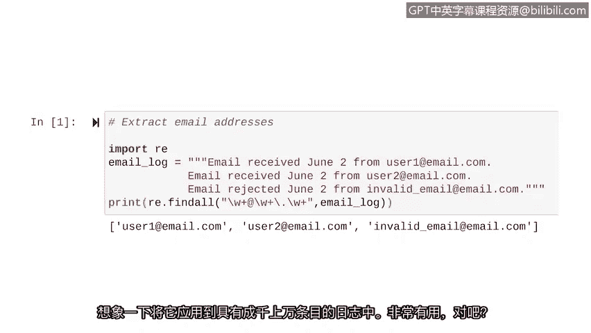

# 028：Python中的正则表达式 🐍

在本节课中，我们将要学习一种更高级的字符串搜索方法：正则表达式。我们将了解其基本概念、核心符号，并学习如何构建模式来从文本（如日志文件）中提取特定信息，例如电子邮件地址。

我们已经学习了很多关于处理字符串的知识，包括使用位置索引和分析切片。在上一节中，我们应用这些知识从IP地址列表中提取了前三位数字。本节中，我们将专注于一种更高级的字符串搜索方式。

正则表达式（常缩写为regex）是一个构成搜索模式的字符序列。这个模式可以在搜索日志文件时使用。我们可以用它来搜索任何类型的模式。例如，我们可以找到所有以特定前缀开头的字符串，或者找到所有特定长度的字符串。

我们可以通过多种方式将其应用于安全场景。例如，假设我们需要找到所有网络ID为184的IP地址。正则表达式将允许我们高效地搜索此模式。

在本视频中，我们将研究另一个例子。假设我们想要提取日志中包含的所有电子邮件地址。如果我们尝试通过索引方法来实现，我们需要知道要搜索的确切电子邮件地址。作为安全分析师，我们很少拥有这类信息。但是，如果我们使用一个告诉Python电子邮件地址结构的正则表达式，我们将返回所有具有与电子邮件地址相同元素的字符串。

即使我们面对一个包含数千行和条目的日志文件，我们也可以通过正则表达式搜索电子邮件地址的结构来提取文件中的每一个电子邮件。我们不需要知道具体的电子邮件地址就能提取它们。

让我们探索实现此功能所需的正则表达式符号。首先，我们来学习加号（`+`）。

加号（`+`）是一个正则表达式符号，代表特定字符的一次或多次出现。让我们通过一个示例模式来解释。正则表达式模式 `a+` 匹配一个其中字母`a`重复出现的任意长度的字符串。例如，单个`a`、连续三个`a`或连续五个`a`。它甚至可以是连续1000个`a`。

我们可以通过一个快速示例来查看此模式将提取哪些字符串。假设我们有一个设备ID字符串列表。这些是字母`a`出现一次或连续多次的所有实例。第一个实例有1个`a`，第二个有2个`a`，第三个有1个`a`，第四个有3个`a`。因此，如果我们告诉Python查找与正则表达式 `a+` 匹配的内容，它将返回这个`a`的列表。

我们需要的另一个基础构件是 `\w` 符号。它匹配任何字母数字字符，但不匹配符号。`1`、`K`和`i` 只是 `\w` 可以匹配的三个例子。

正则表达式可以轻松组合，以允许在搜索中使用更复杂的模式。在将其应用于电子邮件场景之前，让我们探索一下如果将 `\w` 与加号（`+`）结合可以搜索哪些模式。

`\w` 匹配任何字母数字字符，而加号（`+`）匹配其前面字符的任意多次出现。这意味着 `\w+` 的组合匹配任意长度的字母数字字符串。`\w` 为此正则表达式匹配的字母数字字符提供了灵活性，而加号（`+`）为其匹配的字符串长度提供了灵活性。

字符串 `1`、`9`、`2`、`ABC`、`123` 和 `security` 只是与 `\w+` 匹配的三个可能字符串。

现在，让我们应用这些知识从日志中提取电子邮件地址。电子邮件地址由被某些符号（如`@`符号和句点`.`）分隔的文本组成。让我们学习如何将其表示为正则表达式。

首先，考虑典型电子邮件地址的格式，例如 `user1@email.com`。电子邮件地址的第一段包含字母数字字符，并且字母数字字符的数量可能长度不一。我们可以使用正则表达式 `\w+` 来匹配此部分，以匹配任意长度的字母数字字符串。

电子邮件地址中的下一段是`@`符号。这段始终存在。我们将在正则表达式中直接输入这个符号。这对于确保Python将电子邮件地址与其他字符串区分开来至关重要。

`@`符号之后是域名。与第一段一样，这部分因电子邮件地址而异，但它始终包含字母数字字符，因此我们可以再次使用 `\w+` 来适应这种变化。

接下来，就像`@`符号一样，句点`.`始终是电子邮件地址的一部分。但与正则表达式中的`@`符号不同，句点`.`具有特殊含义。因此，我们需要在这里使用 `\.`。当我们在它前面加上反斜杠时，我们让Python知道我们不打算将其用作运算符，并且我们的模式应在此位置包含一个句点。

对于最后一段，我们也可以使用 `\w+`。电子邮件地址的最后部分通常是`.com`，但也可能是其他字符串如`.net`。

当我们把这些部分组合在一起时，就得到了用于在日志中查找电子邮件地址的正则表达式：`\w+@\w+\.\w+`。这个模式将匹配所有电子邮件地址，并排除字符串中的所有其他内容。这是因为我们在电子邮件地址结构中出现的位置包含了`@`符号和句点。

让我们在Python中实现它。我们将使用正则表达式从字符串中提取电子邮件地址。当`re`模块被导入Python后，就可以使用正则表达式。因此，我们从这一步开始。稍后，我们将学习如何导入和打开文件（如日志）。但现在，我们已将日志存储为一个名为`email_log`的字符串变量。由于这是一个多行字符串，我们使用三组引号而不是一组。

接下来，我们将对正则表达式应用`re`模块中的`findall`函数。`re.findall`返回与正则表达式匹配的列表。

让我们将其与我们之前为电子邮件地址创建的正则表达式一起使用。第一个参数是我们想要匹配的模式。请注意，我们将其放在引号中。第二个参数指示在哪里搜索该模式。在本例中，我们正在搜索`email_log`变量中包含的字符串。

当我们运行此代码时，我们得到了字符串中所有电子邮件的列表。想象一下将其应用于具有数千条条目的日志。非常有用，对吧？这只是对正则表达式强大功能的介绍。还有更多符号可以使用。我鼓励你自行探索正则表达式并了解更多。

在本节课中，我们一起学习了正则表达式的基础知识，包括加号（`+`）和`\w`等符号的含义，以及如何将它们组合起来构建复杂的搜索模式。我们特别实践了如何构建一个匹配电子邮件地址结构的正则表达式模式（`\w+@\w+\.\w+`），并使用Python的`re.findall()`函数从文本中提取所有匹配项。这为自动化处理日志文件等网络安全任务提供了强大的工具。