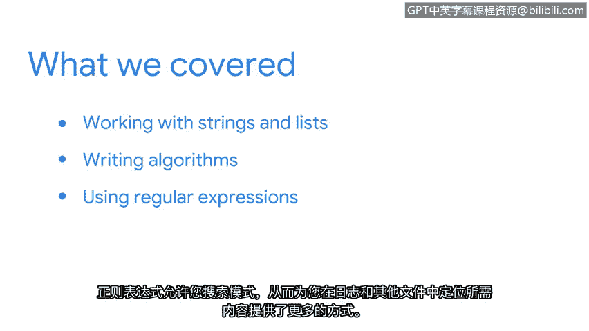

**Python自动化网络安全任务：第七课：总结**


在本节课中，我们将回顾并总结第七课所涵盖的核心概念与技能。

我们共同完成了许多内容。现在花点时间快速回顾一下我们学习的所有新概念。

**字符串与列表操作**

我们首先聚焦于字符串和列表的处理。我们学习了专门用于这些数据类型的方法，例如：
*   **字符串方法**：如 `.upper()`, `.lower()`, `.split()`。
*   **列表方法**：如 `.append()`, `.remove()`, `.index()`。

同时，我们也学习了如何使用索引来定位和提取所需的信息，例如通过 `my_string[0]` 或 `my_list[2:5]` 来访问特定元素或子序列。

**算法编写**

接下来，我们重点学习了编写算法。我们编写了一个简单的算法，用于从IP地址列表中提取网络ID。这通常涉及字符串分割和切片操作，例如：
```python
ip_address = "192.168.1.100"
network_id = ".".join(ip_address.split(".")[:3])  # 结果为 "192.168.1"
```

**正则表达式**

最后，我们学习了使用正则表达式。正则表达式允许你搜索特定的文本模式，这为在日志文件和其他文件中定位所需信息提供了更强大的方法。例如，模式 `\d{1,3}\.\d{1,3}\.\d{1,3}\.\d{1,3}` 可用于匹配IP地址。



这些概念具有一定复杂性。欢迎你随时重新观看相关视频以加深理解。

掌握这些概念后，你在处理数据和编写安全专业人员所需的算法方面迈出了一大步。

在本课程的后续部分，你将获得更多关于Python及其在安全分析中应用的实践机会。

**总结**


本节课中，我们一起学习了Python中处理字符串和列表的核心方法、编写简单算法的基础，以及使用正则表达式进行模式匹配的强大功能。这些技能是自动化网络安全任务的重要基石。