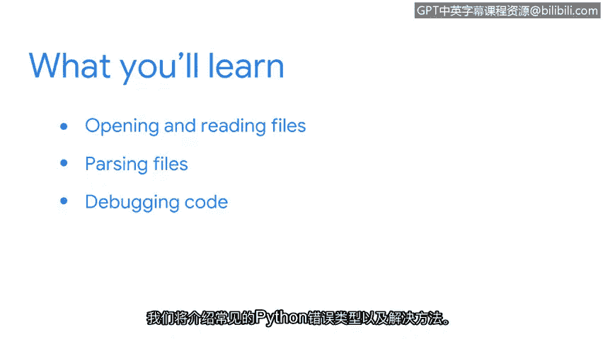

# 030：欢迎来到第四周 🚀

在本节课中，我们将要学习如何将Python应用于实际的网络安全分析工作中。我们将重点探讨如何处理和分析安全日志文件，并学习如何调试代码以解决常见的错误。

我们已经一起学习了许多关于Python的知识，并且还有更多内容等待探索。在本节中，我们将探索像您这样的安全分析师如何将Python付诸实践。

作为一名安全分析师，您很可能会处理记录各种系统活动信息的安全日志。这些日志通常非常庞大，难以快速解读。但Python可以轻松地自动化这些任务，使工作变得更加高效。

因此，首先我们将重点学习在Python中如何打开和读取文件，这包括日志文件。之后，我们将探索如何解析文件。这意味着您将能够以提供您所关注的安全相关信息的方式来处理文件。

最后，编写代码的一部分工作是调试代码。能够解读错误信息以使您的代码正常运行，这一点非常重要。我们将涵盖常见的Python错误类型及其解决方法。

总的来说，在完成本节学习后，您将对Python以及作为一名安全分析师如何运用它有更深入的理解。我迫不及待地想与您一同学习。😊

---

本节课中我们一起学习了第四周的课程概述，明确了我们将要探索如何利用Python处理安全日志、解析文件以及调试代码。这些技能对于高效地进行网络安全分析至关重要。