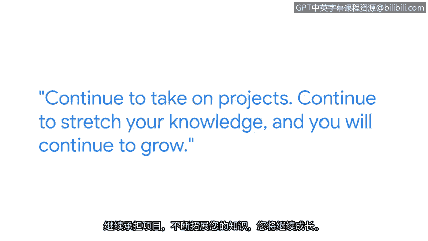

# 032：持续学习与Python应用

## 概述

在本节课中，我们将跟随谷歌高级安全工程师克兰西的分享，了解Python在网络安全领域的实际应用价值，以及如何通过持续学习和实践来掌握这门强大的编程语言。课程将重点阐述Python的特点、学习路径以及给初学者的建议。

---

我的名字是克兰西，我是一名高级安全工程师。

我在谷歌的团队致力于持续保护谷歌的敏感信息和客户数据。

我的日常工作每天都不相同，这让我有机会运用不同的技能和知识体系，没有哪两天是完全一样的。

严格来说，我并非工程师或软件工程师出身；我实际上曾是会计专业。亲身经历任何类型的网络安全攻击，无疑会让你从对立面的角度获得深刻见解。

你能看到这如何影响用户，如何影响遭受攻击的人们。

如果我刚开始职业生涯时就了解网络安全领域究竟有多么广阔，那将能让我更早地开始探索。Python是我在谷歌的职位上经常使用的一种开发语言。

关于Python，我最喜欢的一点是它的强大能力。你可以用它创建功能强大的脚本，并将其应用于日常工作中。

当我最初学习Python时，最棘手的部分是学会如何以“Pythonic”的方式表达逻辑。

我利用了各种在线资源、书籍，并着手进行一些副业项目。Python最大的优点之一是它是一门应用非常广泛的语言，你可以根据自身技能水平，在网上找到海量的学习资源。

Python以及任何其他开发语言都在不断演进。

持续承担项目，持续拓展你的知识边界，你就能持续成长。

我能给刚开始学习Python的人的建议是：让它变得有趣。我认为，一旦你发现学习一门语言是有趣的，你就能更投入地学习。首先，为网络安全建立一个良好的知识基础。

在起步阶段，让自己涉猎广泛一些，变得全面一些。然后，你可以从那里出发，深入钻研你感兴趣的主题。

刚开始时可能会非常艰难，你会感觉像是在攀登一座大山。

请坚持下去，持续学习，这最终将是一段非常有价值的经历。

---

## 总结

本节课中，我们一起学习了高级安全工程师克兰西的经验分享。我们了解到Python因其强大和灵活的特性，成为网络安全自动化任务中的重要工具。掌握Python的关键在于以“Pythonic”的思维方式解决问题，并充分利用丰富的在线资源进行学习。对于初学者，建立广泛的网络安全知识基础，并通过有趣的项目保持学习动力至关重要。网络安全和编程语言都在不断发展，因此保持持续学习和实践是职业成长的核心。尽管起步可能充满挑战，但坚持不懈终将带来丰厚的回报。