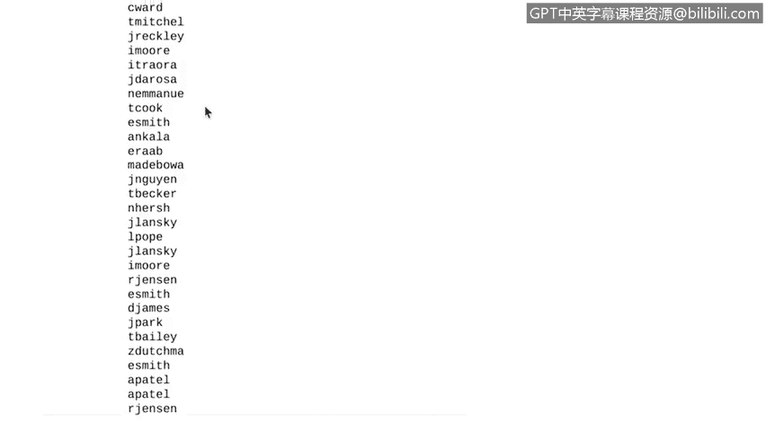

# 033：用Python访问文本文件


在本节课中，我们将学习如何使用Python读取文本文件。这对于网络安全专业人员处理日志文件等任务至关重要。我们将从基础开始，学习如何打开文件、读取内容并将其存储为字符串，为后续处理安全日志打下基础。

## 打开并读取文本文件

网络安全专业人员经常需要审查日志文件。这些文件可能包含成千上万的条目，因此自动化此过程会很有帮助。这正是Python可以发挥作用的地方。我们将从一个只包含几个单词的简单文本文件开始，学习如何在Python中读取它并将其存储为字符串。

我们只需要文本文件、其位置以及正确的Python关键字。以下是实现此目标的核心步骤。

### 使用 `with` 语句

我们将从输入一个 `with` 语句开始。关键字 `with` 用于处理错误和管理外部资源。当使用 `with` 时，Python知道自动释放那些在程序运行结束前会占用系统资源的资源。在文件处理中，它常用于在读取文件后自动关闭文件。

要打开并读取文件，我们编写一个以关键字 `with` 开头的语句。

### `open` 函数

`open` 是Python中用于打开文件的函数。其基本语法如下：

```python
open(file, mode)
```

*   **第一个参数**：是您计算机上文本文件的名称，或其在互联网上的链接。根据Python环境，您可能还需要包含此文件的路径。请记住在文件名中包含扩展名，例如 `.txt`。
*   **第二个参数**：此参数告诉Python我们想对文件做什么操作。在我们的例子中，我们想读取文件，因此我们在引号中使用字母 `"r"`。如果我们想写入文件，我们会将此 `"r"` 替换为 `"w"`，但这里我们专注于读取。

### 文件变量与代码块

`file` 是一个变量，只要我们在 `with` 语句内部，它就包含文件信息。与其他类型的语句类似，我们以冒号结束 `with` 语句。冒号后的代码将告诉Python如何处理文件的内容。

## 实践操作：读取文件内容

现在，让我们进入Python并使用我们学到的知识。我们准备在Python中打开一个文本文件。

首先，我们输入 `with` 语句。接下来，我们将使用Python内置的 `read` 方法。`read` 方法将文件内容转换为字符串。

让我们回到我们的 `with` 语句。类似于 `for` 循环，`with` 语句在下一行开始缩进。这告诉Python此代码正在 `with` 语句内部执行。

在语句内部，我们将使用 `read` 函数将文件转换为字符串，并将其存储在一个新变量中。这个新变量可以在 `with` 语句外部使用。

因此，让我们通过取消缩进来退出 `with` 语句，并打印该变量。完美，文本中的字符串被打印出来了。

## 总结与展望



本节课中，我们一起学习了如何使用Python的 `with` 语句和 `open` 函数安全地打开并读取文本文件，以及如何使用 `read` 方法将文件内容转换为字符串。这是自动化处理文件（如安全日志）的第一步。

接下来，我们将讨论解析文件，以便我们将来能够处理安全日志。