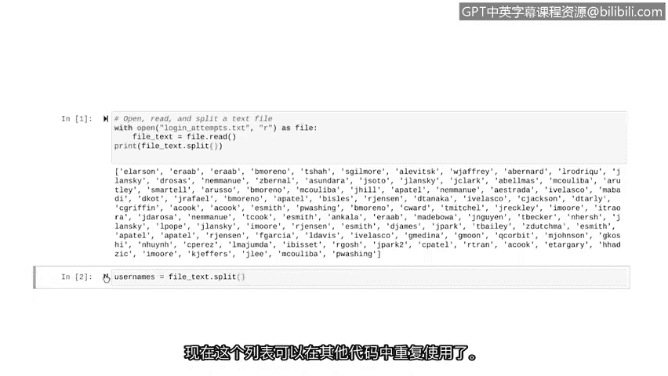
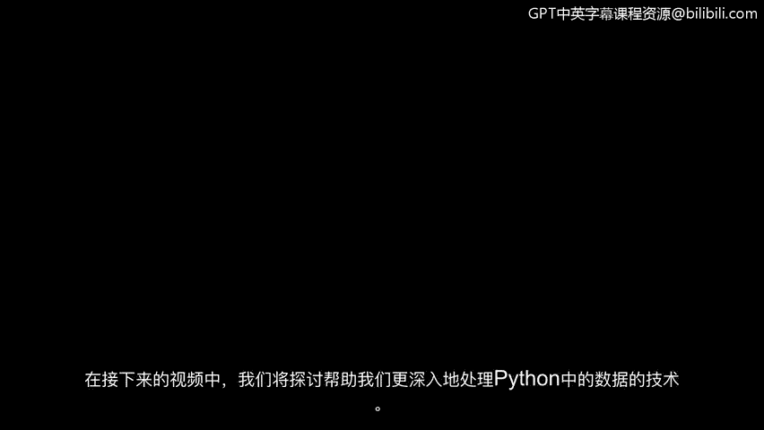

# 034：用Python解析文本文件


在本节课中，我们将学习如何解析文本文件。解析是将数据转换为更易读格式的过程。我们将结合之前学到的列表和字符串知识，并学习一个新的字符串方法——`split`方法，来为文本文件赋予结构，从而更轻松地分析数据。

上一节我们介绍了如何将文本文件导入Python。本节中，我们来看看如何进一步处理这些文本，即解析它们。

## 解析与`split`方法

解析是将数据转换为更易读格式的过程。为了实现解析，我们需要使用字符串的`split`方法。这个方法可以将一个字符串转换成列表。

`split`方法通过基于指定字符分隔字符串来工作。如果不传递任何参数，则每次遇到空白字符（如空格、换行符）时，它就会分隔字符串。

以下是`split`方法的基本用法：

```python
# 示例：使用split方法
text = "We are learning about parsing."
word_list = text.split()
print(word_list)
# 输出: ['We', 'are', 'learning', 'about', 'parsing.']
```

我们使用`split`方法将字符串分割成更小的片段，这比分析一大块文本要容易得多。

## 解析安全日志示例

在本视频的示例中，我们将处理一个安全日志文件，其中每一行代表一个新的数据点。我们的目标是将文本基于换行符进行分隔。

Python将换行符视为一种空白字符，因此我们可以直接使用不带参数的`split`方法。

我们将从上一节的代码开始。以下是打开文件并将其内容读入字符串的代码：

```python
# 从上一节延续的代码：打开并读取文件
with open('update_log.txt', 'r') as file:
    log_data = file.read()
```

现在，让我们使用`split`方法将这个字符串分割成列表，然后打印输出：

```python
# 使用split方法解析字符串
username_list = log_data.split()
print(username_list)
```

运行这段代码后，Python会输出一个用户名列表，而不是一个长长的字符串。

如果我们想保存这个列表以供后续使用，需要将其赋值给一个变量。例如，我们可以将这个变量命名为`usernames`：

```python
# 将解析后的列表保存到变量中
usernames = log_data.split()
print(usernames)
```



现在，这个`usernames`列表就可以在其他代码中重复使用了。

## 总结

本节课中我们一起学习了Python中解析文本文件的基础知识。我们了解到，**解析**是将数据（如文本文件内容）转换为更结构化、更易分析格式的过程。核心是通过字符串的**`split()`方法**来实现这一转换，该方法能将字符串基于分隔符（默认为空白字符）分割成一个列表。



你已经掌握了将文本文件内容解析为结构化数据列表的基本技能。在接下来的视频中，我们将探索更多技术，以帮助更深入地处理和分析Python中的数据。