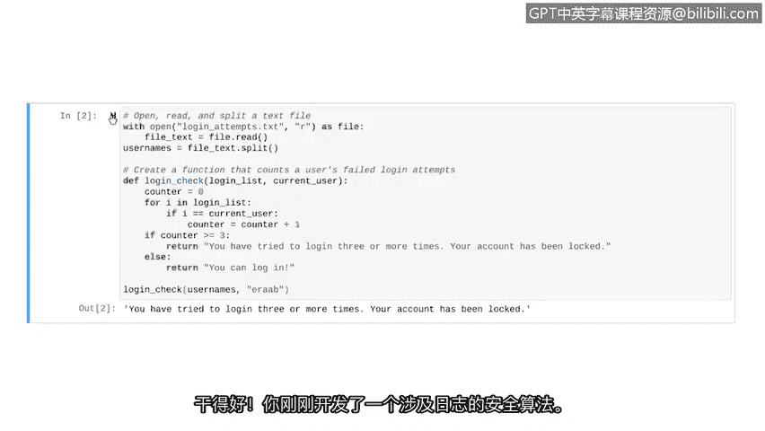

# 035：用Python开发解析算法 🐍


在本节课中，我们将综合运用之前学到的知识，学习如何导入文件、解析数据，并实现一个简单的算法来检测可疑的登录尝试。我们将创建一个程序，在每次有新用户登录时运行，检查该用户是否有三次或更多次失败的登录尝试。

## 概述

我们将处理一个存储失败登录尝试的日志文件。程序的核心任务是：读取日志文件，统计特定用户名的出现次数，如果次数达到或超过三次，则发出警报。我们将从文件导入开始，逐步构建一个完整的解析和检测算法。

## 导入与解析日志文件

首先，我们需要导入包含失败登录尝试的日志文件。该文件是TXT格式，每行包含一个用户名，每个用户名代表一次失败的登录尝试。

以下是导入文件并将其内容存储到变量中的代码：

```python
with open('login_attempts.txt', 'r') as file:
    usernames = file.read().splitlines()
```

我们使用 `with open` 语句打开文件，`'r'` 表示读取模式。`file.read().splitlines()` 方法读取整个文件内容，并按行分割，将每一行作为一个元素存入名为 `usernames` 的列表中。

为了验证导入是否成功，我们可以打印 `usernames` 变量的内容：

```python
print(usernames)
```

运行代码后，如果输出显示一个用户名列表，则说明文件已成功导入并解析。现在，`usernames` 列表已准备就绪，可供我们的算法使用。

## 设计计数算法策略

上一节我们成功导入了数据，本节中我们来看看如何统计列表中特定用户名的出现次数。我们以列表中的前八个元素为例进行说明。

假设我们注意到用户名 “eraab” 在列表中出现了两次。我们需要设计一种方法，让Python能够自动进行这种计数。

我们将实现一个 `for` 循环来遍历列表中的每个元素。同时，我们定义一个计数器变量，初始值设为0。

以下是算法的逻辑步骤：
1.  遍历列表中的每个用户名。
2.  对于每个用户名，检查它是否等于我们正在查找的目标用户名（例如 “eraab”）。
3.  如果相等，则将计数器加1。
4.  如果不相等，则计数器保持不变。

遍历完整个列表后，计数器的值就是目标用户名出现的总次数。

## 在Python中实现算法

现在我们已经明确了解决方案，接下来看看如何在Python代码中实现它。解决这个问题将涉及一个 `for` 循环、一个计数器变量和一个 `if` 语句。

让我们回到代码编辑器，创建一个函数来统计用户的失败登录尝试次数。

首先，定义我们的函数：

```python
def login_check(login_list, current_user):
```

这个函数名为 `login_check`，它接受两个参数：
*   `login_list`：用于传入失败登录尝试的列表。
*   `current_user`：用于传入当前正在尝试登录的用户名。

在函数内部，我们首先定义计数器变量并将其初始值设为0：

```python
    counter = 0
```

接下来，启动一个 `for` 循环。我们将使用 `i` 作为循环变量，遍历 `login_list`：

```python
    for i in login_list:
```

在 `for` 循环内部，我们使用一个 `if` 语句。该语句检查循环变量 `i`（即当前遍历到的用户名）是否等于我们正在搜索的 `current_user`：

```python
        if i == current_user:
```

如果这个条件为真，我们希望对计数器加1：

```python
            counter = counter + 1
```

至此，计数逻辑已完成。现在，我们只需要最后的 `if-else` 语句来根据计数结果打印警报。

如果计数器累加到3或更多，我们需要告知用户其账户已被锁定。我们也会为可以登录的用户编写一条 `else` 语句：

```python
    if counter >= 3:
        print("Account locked. Too many login attempts.")
    else:
        print("You can log in.")
```

我们的算法现在已经完成。

## 测试算法功能

让我们用一个示例用户名来测试新创建的函数。我们可以从列表中选取几个用户名进行尝试。

首先，使用列表中的第一个用户名进行测试：

```python
login_check(usernames, "elarson")
```

运行代码。根据输出，如果显示 “You can log in.”，则说明该用户的失败登录尝试少于三次。

现在，让我们测试之前提到的用户 “eraab”。在列表的前八个名字中，它出现了两次。你认为他能够登录吗？

运行测试：



```python
login_check(usernames, "eraab")
```

如果得到 “Account locked.” 的消息，则意味着该用户有三次或更多次失败的登录尝试。优秀！你已经开发了第一个涉及日志分析的安全算法。

随着技能的增长，你将学习如何使这个算法更加高效，但目前的解决方案运行良好。

## 总结

在本节课中，我们一起学习了如何将列表操作、算法开发和文件解析等知识综合运用。我们通过构建一个可在安全上下文中应用的算法来实现这一目标。具体来说，我们：
1.  导入并解析了包含失败登录尝试的TXT日志文件。
2.  设计了一个使用 `for` 循环和计数器来统计用户名出现次数的策略。
3.  在Python中实现了一个名为 `login_check` 的函数，该函数能够分析登录列表并针对可疑尝试发出警报。
4.  通过实际用户名测试了算法的功能。


这个程序是自动化安全任务的一个基础而实用的例子。