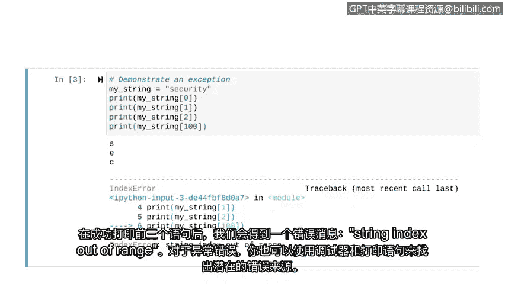

# 036：调试策略 🐛


在本节课中，我们将学习如何识别和修复Python代码中的错误。作为一名安全分析师，阅读或编写代码是常见任务，而让代码正确运行并发挥功能是最大的挑战之一。事实上，修复复杂的代码错误有时比编写代码本身花费的时间一样多，甚至更多。因此，掌握调试技能至关重要。我们已经学习了Python编程基础，现在需要学习如何处理错误。为此，我们将重点讨论代码调试。

调试是指识别和修复代码错误的过程。本视频将探讨一些调试技术。

## 错误类型

代码错误主要分为三种类型：语法错误、逻辑错误和异常。

### 语法错误

语法错误涉及对Python语言的无效使用，例如在函数定义后忘记添加冒号。

让我们探索这种错误类型。当我们运行以下代码时，会收到一条指示存在语法错误的消息。根据Python环境，它可能还会显示其他详细信息。我们通常会获得有关错误的信息，例如其位置。

```python
def my_function()
    print("Hello")
```

这些语法错误通常很容易修复，因为你可以精确地找到错误发生的位置。它们类似于纠正电子邮件中的简单语法错误。由于错误消息告诉我们问题出在定义函数的那一行，让我们去那里看看。在这种情况下，我们可以在函数头后添加一个冒号来解决错误。当我们再次运行它时，就不再出现错误消息了。

这只是语法错误的一个例子。其他例子包括：函数调用后省略括号、拼错Python关键字或未正确关闭字符串的引号。

### 逻辑错误

上一节我们介绍了语法错误，本节中我们来看看逻辑错误。逻辑错误可能不会导致错误消息，而是产生非预期的结果。一个逻辑错误可能很简单，比如在打印语句中写错了文本；也可能涉及更复杂的情况，比如写了一个小于符号而不是小于或等于符号。

这种操作符的改变会排除代码按预期工作所需的一个值。例如，假设你只在问题的优先级小于3（而不是小于或等于3）时才联系响应团队。这意味着所有被归类为优先级3的事件都可能被忽视且无法解决。

以下是诊断难以发现的逻辑错误的策略：

*   **使用打印语句**：你需要在代码中各处插入打印语句。这些打印语句应描述代码中的位置，例如 `print("第20行")` 或 `print("条件语句内第55行")`。其思路是使用这些打印语句来识别代码的哪些部分运行正常。当一个打印语句没有按预期打印时，这有助于你识别出有问题的代码部分。
*   **使用调试器**：另一个识别逻辑错误的选项是使用调试器。调试器允许你在代码中插入断点。断点允许你将代码分段，并一次只运行一部分。就像使用打印语句一样，独立运行这些部分有助于隔离代码中的问题。

### 异常

我们讨论了语法和逻辑错误，现在来关注最后一种错误类型：异常。异常发生在程序不知道如何执行代码时，即使语法没有问题。异常的发生有多种原因。

例如，当出现数学上不可能的情况时会发生异常，比如要求代码除以0。当你要求Python访问不存在的索引值时，或者当Python无法识别变量或函数名时，也可能发生异常。使用不正确的数据类型时也可能发生异常。

让我们演示一个异常。假设你有一个名为 `my_string` 的变量，其中包含单词 `"security"`。由于这个字符串有8个字符，我们可以成功打印任何小于8的索引。索引0包含 `'S'`，索引1包含 `'E'`，索引2包含 `'C'`。

```python
my_string = "security"
print(my_string[0])  # 输出: s
print(my_string[1])  # 输出: e
print(my_string[2])  # 输出: c
```

但是，如果你尝试访问索引100处的字符，就会得到一个错误。

```python
print(my_string[100])  # 这将引发异常
```

让我们运行这些代码，看看会发生什么。在成功打印前三个语句后，我们得到一个错误消息：`IndexError: string index out of range`。

对于异常错误，你也可以利用调试器和打印语句来找出错误的潜在来源。



## 总结


在本节课中，我们一起学习了Python编程中三种主要的错误类型及其调试策略。语法错误涉及无效的Python语法，通常易于定位和修复。逻辑错误不会中断程序，但会导致非预期结果，可以通过插入打印语句或使用调试器来诊断。异常发生在运行时，即使语法正确，程序也无法执行某些操作。在Python中工作时，遇到错误和异常是预料之中的事。重要的是要知道如何处理它们。希望本视频提供了关于调试代码的一些有价值的见解，这将有助于确保你编写的代码功能正常。