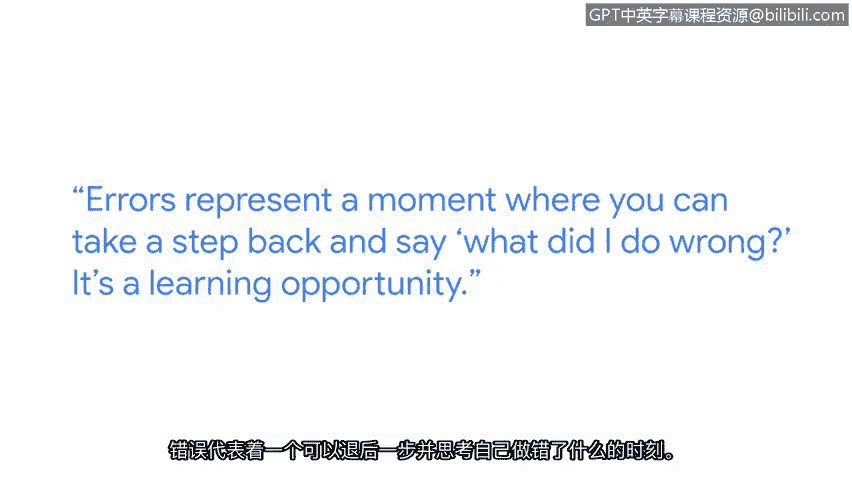

# 037：从错误中学习

在本节课中，我们将跟随软件工程师马特的分享，学习如何将编程中的错误视为宝贵的学习机会，并了解在网络安全工作中处理复杂问题的思维方式。

我叫马特，是一名从事网络安全工作的软件工程师。高中时，我真正想做的是音乐，我曾是一名音乐家。因此，我去了音乐学校学习爵士长号。在这个过程中，我逐渐意识到，没有哪个明智的乐队领队会看着一个团队，然后认为我们需要一个长号手来让事情变得更好。

我从小看着《黑客帝国》这样的电影长大。虽然这与网络安全工作的实际情况不太一样，但它确实能带来一些启发。当你深入挖掘工作的具体细节，再退一步看全局时，你就像那个戴着谷歌眼镜的黑客。

当我刚开始写代码时，我会把编码错误看作是我做得不好的标志。但随着年龄增长，我变得更加成熟，意识到每个人都会犯编码错误。我认识的最优秀的软件工程师写的代码也会有错误。错误代表了一个你可以退一步思考的时刻，去问自己“我做错了什么”。这是一个学习的机会。

现在，我把这些错误看作是审视我不理解的问题、并深入探究以扩展计算机科学知识的时刻，而这正是我工作的全部。所以，我把这看作一个学习过程，并且它还有点乐趣。

接下来，我将分享一个我在谷歌工作时遇到的非常棘手的编码错误案例。

以下是我在谷歌遇到的一个非常棘手的编码错误案例，它涉及“指纹识别”技术。

当我们发现一个漏洞时，如果我们后来发现了相同的漏洞，我们不希望有两个重复的漏洞记录。我们不想两次提醒同一个人去修复同一个问题。因此，我们采用了一种称为“指纹识别”的技术。我们为每个漏洞分配一个特定的“指纹”。如果我们发现另一个具有相同指纹的漏洞，我们不会将它们分开存储或处理，因为它们本质上是同一个漏洞。

我遇到了这样的错误：某些漏洞没有按照我预期的方式进行指纹识别。我为此绞尽脑汁了好几个星期，试图弄清楚到底哪里出了问题。但当我最终找到原因时，那种感觉非常、非常满足。就像“哦，原来是这样”。

当你深陷于这种混乱中时，所有的自我怀疑都会涌入脑海。你可能会想：“也许我并没有自己想象的那么擅长这件事。”如果我能回到过去告诉当时的自己，我会说两点：第一，困境不是永无止境的，情况会好转。一旦你解决了问题，那种成就感是无与伦比的。第二，向他人求助是完全没问题的。

如果你正在为某件事而挣扎，我总是提倡寻求帮助。大多数人都会非常乐意帮助你解决问题，尤其是当它涉及一个复杂的问题时。

我非常高兴自己最终进入了网络安全领域。网络安全正处在一个重要的时代。人们开始意识到他们向世界投放的数据量，并开始关心数据安全。因此，每天都有新事物出现，每天都有让我感到兴奋的事情可做。是的，投身其中吧。网络安全是未来的方向。

在本节课中，我们一起学习了如何将编程错误视为学习和成长的机会，了解了网络安全中“指纹识别”的概念，并认识到在遇到难题时寻求帮助的重要性。记住，错误不是终点，而是通往精通的阶梯。