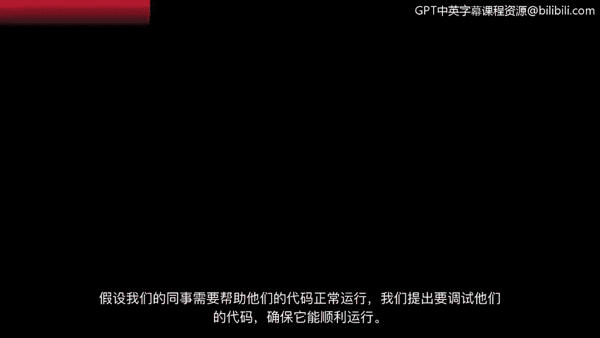
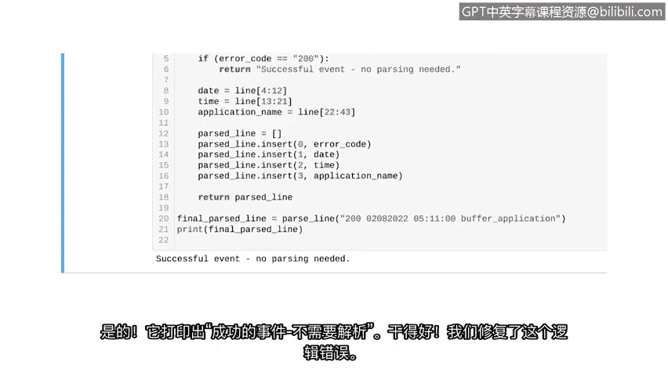

# 038：应用调试策略 🐛

在本节课中，我们将学习如何应用系统性的调试策略来解决Python代码中的问题。我们将通过一个实际案例，逐步识别并修复语法错误、异常和逻辑错误，最终确保代码按预期运行。

---

假设我们的同事需要帮助让他们的代码正常工作。我们主动提出调试他们的代码，以确保其平稳运行。

首先，我们需要了解代码的用途。在本例中，代码的目的是**解析日志文件中的单行数据并返回它**。我们使用的日志文件用于跟踪软件应用程序的潜在问题。日志中的每一行都包含HTTP响应状态码、日期、时间和应用程序名称。

编写此代码时，我们的同事考虑了是否所有状态码都需要解析。由于状态码200表示成功事件，他们得出结论：**不应解析包含此状态码的行**。相反，Python应返回一条消息，指示无需解析。

## 识别错误

为了开始调试过程，我们首先运行代码以识别出现了哪些错误。

我们的第一个错误是**语法错误**。错误信息还告诉我们，语法错误发生在定义函数的那一行。

让我们滚动到代码的那一部分。你可能还记得，函数定义行应以冒号结尾。我们继续在代码中添加冒号。现在，语法错误应该消失了。让我们再次运行代码。

## 处理异常

现在我们的语法错误消失了，这是个好消息，但我们遇到了另一个错误：**NameError**。

NameError实际上是一种异常类型，意味着我们编写的语法是有效的，但Python无法处理该语句。根据错误信息，解释器在将变量 `application name` 添加到 `parse_line_list` 时无法理解它。

让我们检查代码的那一部分。这个错误意味着我们没有正确分配变量名。现在，让我们回到它首次被赋值的地方，看看发生了什么。

我们发现这个变量拼写错误。`application name` 应该是两个单词，而不是一个。让我们纠正拼写。修复后，它应该可以工作了。所以，让我们运行代码。

## 检查逻辑

太好了，我们修复了一个错误和一个异常。并且不再有任何错误消息。但这并不意味着我们的调试工作已经完成。我们需要通过检查输出来确保程序的逻辑按预期工作。

我们的输出是一个解析后的列表。在大多数情况下，这正是我们想要的。但你可能还记得，如果状态码是200，我们的代码**不应该解析该行**。相反，它应该打印一条消息，说明无需解析。

然而，当我们用状态码200调用它时，并没有显示这条消息。这表明存在一个**逻辑错误**。

## 定位逻辑错误

让我们回到用于处理状态码200的条件语句并进行调查。为了找到问题的根源，我们添加一些 `print` 语句。

在我们的 `print` 语句中，我们包含了行号和位置描述。
*   我们将在包含 `return parse_list` 的代码行之前添加一个 `print` 语句。
*   我们将在检查200状态码的 `if` 语句上方添加另一个 `print` 语句，以确定程序是否执行到了该 `if` 语句。
*   我们将在 `if` 语句内部再添加一个 `print` 语句，以确定程序是否进入了该分支。

现在，让我们运行代码并查看打印出的内容。

只有第一个 `print` 语句打印了内容。之后的另外两个 `print` 语句没有打印任何东西。这意味着程序甚至没有进入那个 `if` 语句。

问题发生在返回 `parse_line` 变量的那一行之前的某个地方。

## 修复逻辑错误

让我们进一步调查。当Python遇到第一个 `return` 语句（即返回 `parse_list` 的那一行）时，它会退出函数。换句话说，它在检查状态码值是否为200之前就返回了列表。

为了修复这个问题，我们必须将检查状态码的 `if` 语句移到 `return parse_line` 之前的某个位置。

首先，我们删除之前添加的 `print` 语句。这使程序更高效，因为它不会运行任何不必要的代码行。

现在，让我们移动 `if` 语句。我们将其放在从行中解析状态码的代码行之后。

让我们运行代码，确认这修复了我们的问题。是的，它打印了“successful event. No parsing needed.”。

---

## 总结 🎯

在本节课中，我们一起学习了应用系统性的调试策略。我们首先通过运行代码识别了语法错误并进行了修复。接着，我们处理了NameError异常，通过检查变量赋值纠正了拼写错误。最后，我们深入排查了逻辑错误，通过添加 `print` 语句定位问题根源，并通过调整代码执行顺序（将条件判断移到 `return` 语句之前）成功修复了它。这个过程展示了调试代码的基本步骤：识别错误类型、定位问题代码、分析原因并实施修复。