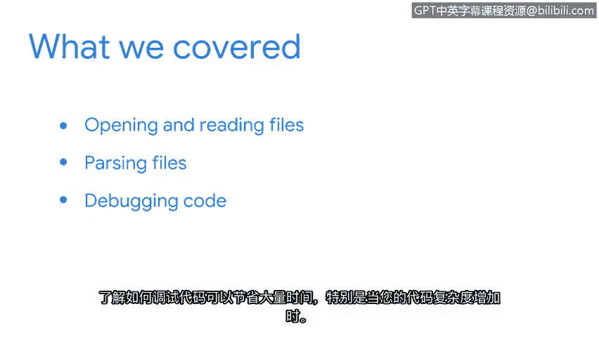

# 039：总结


在本节课中，我们学习了几个新的主题，这些主题将帮助你在安全专业实践中应用Python。

上一节我们介绍了Python的基础知识，本节中我们来看看如何将这些知识应用于处理安全工作中的具体任务。

## 📂 打开与读取文件

首先，我们探讨了如何在Python中打开和读取文件。安全分析师需要处理大量的日志文件，因此掌握这项技能至关重要。以下是读取文件的基本代码示例：

```python
with open('logfile.txt', 'r') as file:
    content = file.read()
```

## 🔍 解析文件

接下来，我们讲解了如何解析文件。日志文件通常非常冗长。因此，解析这些文件的结构，使其更易读，有助于你自动化任务并获取所需信息。例如，我们可以逐行读取并筛选特定信息：

```python
with open('logfile.txt', 'r') as file:
    for line in file:
        if "ERROR" in line:
            print(line)
```



## 🐛 调试代码

最后，我们重点学习了如何调试代码。掌握调试技巧可以为你节省大量时间，尤其是在代码复杂度增加时。使用 `print` 语句或调试器是常见的调试方法。

```python
def calculate_sum(a, b):
    # 调试：打印输入值
    print(f"a: {a}, b: {b}")
    return a + b
```


本节课中我们一起学习了如何用Python处理安全领域的实际问题，包括文件操作、数据解析和代码调试。通过掌握这些技能，你将能够更高效地应对安全挑战。