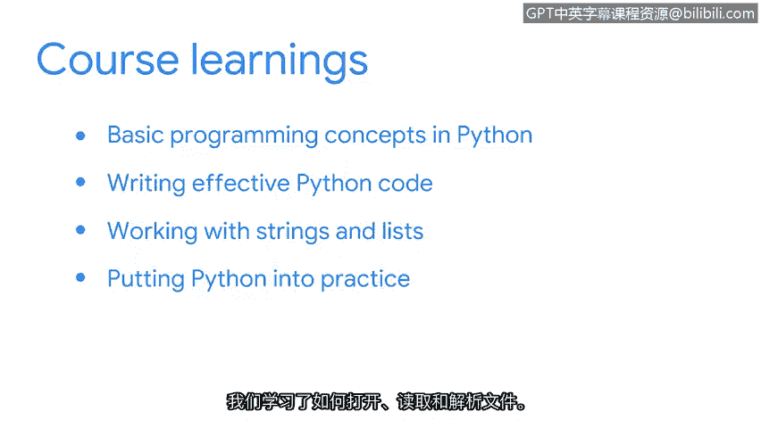

# 040：课程总结

在本节课中，我们将回顾并总结整个课程的核心内容。我们一起学习了Python编程的基础知识及其在网络安全领域的应用。

## 课程回顾

上一节我们探讨了Python在实践中的应用，本节中我们来对整个课程进行总结。

首先，我们学习了Python的基础编程概念。

以下是本课程涵盖的核心主题：

*   **变量、数据类型、条件语句和循环语句**：这些是编程的基石。例如，变量赋值 `name = "Alice"`，条件判断 `if x > 0:`，以及循环 `for item in list:`。
*   **编写高效的Python代码**：我们学习了如何通过**函数**来重用代码，提高效率。这包括使用内置函数和创建自定义函数，例如 `def greet_user(name):`。
*   **模块和库**：我们了解到，通过导入模块（如 `import re`），可以使用其中预打包的函数和变量，从而简化工作。
*   **代码可读性**：我们强调了编写清晰、易读代码的重要性。

接下来，我们的重点是处理字符串和列表。

以下是相关的关键技能：

*   **字符串和列表方法**：我们学习了多种可应用于这些数据类型的方法，例如字符串的 `.upper()` 或列表的 `.append()`。
*   **索引和切片**：我们了解了如何通过索引访问元素，以及如何使用切片语法（如 `my_string[0:5]` 或 `my_list[1:]`）来获取子集。
*   **编写简单算法**：我们综合运用这些知识来编写基础的算法。
*   **正则表达式**：我们探索了如何使用正则表达式（通过 `re` 模块）在字符串中查找复杂模式。

最后，我们将Python投入实践。

以下是本部分的核心实践技能：

*   **文件的打开、读取和解析**：我们学习了如何使用 `open()`、`.read()`、`.readlines()` 等方法来处理文件。掌握这些技能后，你就能处理在安全环境中遇到的各种日志文件。
*   **调试代码**：我们学习了调试的基本方法，这是所有程序员都必须掌握的重要技能。

## 总结与鼓励

本节课中，我们一起学习了Python编程从基础到实践的完整路径。你探索了对安全领域非常有用的编程语言，这值得祝贺。

你在本课程中学到了很多关于Python的知识，做得非常出色。我希望不久后，你能和我一起在网络安全专业中应用Python。

同时，我鼓励你多加练习，并随时可以重新观看这些视频。你越是深入研究这些概念，它们就会变得越容易。

再次感谢你与我一同探索Python。