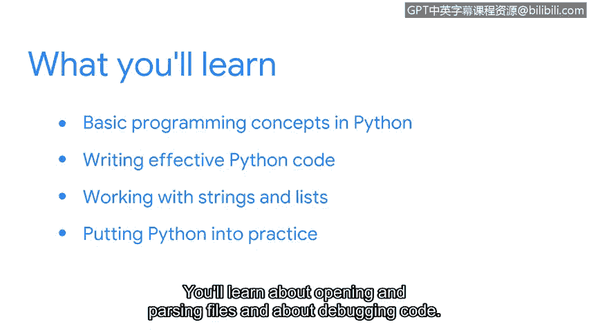

# 041：课程介绍

## 概述

在本节课中，我们将要学习如何将Python编程语言作为网络安全工具箱的一部分，并了解它如何帮助自动化常见的网络安全任务。

对网络安全专业人员的需求达到了前所未有的高度。全球各地的组织都需要具备专业知识和技能的人员来保护其系统免受攻击者侵害。随着威胁数量的不断上升，安全专业人员通常需要执行多种多样的任务。

正因如此，我们将在安全工具箱中引入另一个工具。这个工具可以简化许多常见的安全任务。它不仅被安全专业人员使用，也被工程师和数据科学家广泛采用。这个工具就是Python。

大家好。祝贺你们在安全学习的道路上迈出了新的一步。我叫Anhill，是谷歌的一名安全工程师。我很高兴能在这门课程中与大家一同学习。

## 课程背景与目标

如果你一直在按顺序学习，那么你已经应用了安全专业人员在检测、分析和响应过程中使用的特定工具。你也学会了如何通过Linux和SQL与计算机进行交互。

现在，我们将重点学习如何使用Python编程来完成一些常见的安全任务。当你考虑职业生涯的下一步时，你可能会发现Python技能将在你的日常工作中提供很大帮助。

这门课程旨在从基础开始学习Python。然后，你将逐步在这些基础上进行构建，并将所学知识应用到与安全相关的实例中进行实践操作。

幸运的是，Python以其可读性著称，并且就像所有语言一样，通过练习会变得越来越容易。很快，你可能就会在你的安全职业生涯中使用Python。Python可以自动化文件解析等重要任务的手动操作。

## 讲师经验分享

Python在我的谷歌职业生涯中给了我很大帮助。我所在的团队负责保护谷歌的基础设施，这包括员工使用的所有设备，从笔记本电脑、台式机到网络和云资源。我们通过设计安全解决方案和自动化工作中可重复的部分来实现这一目标。

我喜欢Python的一点是它具有跨平台支持，并且安全社区的成员已经开发了许多使用Python的工具。这使我能够轻松找到所需的工具，并在遇到阻碍时获得支持，从而完成我的专业和个人项目。

我希望这门课程能对你有所帮助。

## 课程内容预览

让我们来了解一下我们将要涵盖的内容。

首先，你将学习Python的基本编程概念。你将了解为什么Python被全球的安全专业人员所采纳。你还将开发并运行你的第一个程序。

接下来，我们将专注于编写高效的Python代码。我们将讨论有助于提高工作效率的概念。

我们的下一个主要主题是关于处理字符串和列表。这些内容将与你将在安全环境中遇到的大量数据密切相关。

最后，你将以探索Python的实际应用来结束本课程。你将学习如何打开和解析文件，以及如何调试代码。

## 总结

本节课中，我们一起学习了Python对于网络安全分析师来说无疑是一项非常有用的技能。让我们开始学习吧。