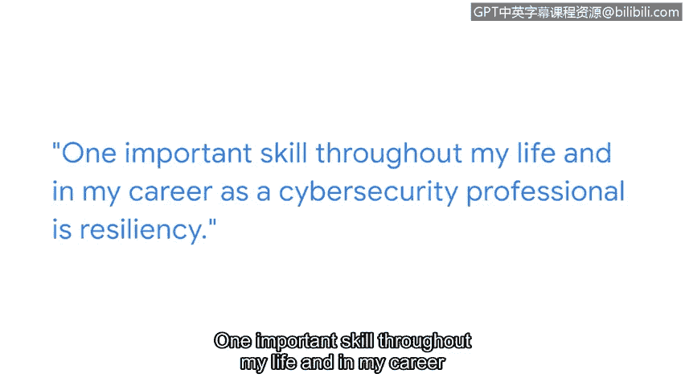

# 042：Angela的个人职业旅程 🛤️

在本节课中，我们将跟随谷歌安全工程师Angela的分享，了解她如何从童年时期的好奇心出发，一步步成长为一名网络安全专家。她的职业旅程强调了好奇心、持续学习和适应能力在技术领域，尤其是网络安全领域中的重要性。

我的名字是Angela，我是谷歌的一名安全工程师。

我人生中的许多事情将我引向了安全领域。

其中之一无疑是我成长过程中的好奇心。

我的父母是会计师，所以他们有袖珍计算器、自动铅笔和钢笔。

我总是把它们拆开，取出零件，试图弄清楚它们的工作原理。

这让我对广义上的技术产生了兴趣。

同样的概念再次适用。

就是试图弄清楚事物如何运作，并拆解它们。

这基本上就是安全领域试图做的事情：拆解事物，以弄清楚是否有人能在你之前破坏它们。

我最初是一名网络工程师。

这份工作是为不同的公司设置防火墙、交换机和路由器。

我想加入网络安全领域，主要是因为我被行业内发生的事情所激励，例如“极光行动”——谷歌被外国行为者黑客攻击的事件。

我当时在阅读相关报道。我在想，我希望我能与那些在前线处理这些问题的人一起工作。

当我开始进入网络安全领域，并希望在我的职业生涯中实现一次跨越时，我明确了我想学习什么，以及我需要达到什么水平。

一个例子是通过Python学习自动化。

我参加了在线课程。

我完成了认证，特别是安全领域非常流行的认证。

然后我开始将其中一些方面融入到我当时的工作中。

当我从墨西哥搬到美国工作时，我不得不学会如何保持灵活。

为了推进你的职业生涯，你必须学习新事物。

有时，你甚至需要学习新事物，只是为了保持在原地。

在安全领域，我认为在整个技术领域都是如此，但尤其是在网络安全领域，你必须不断地重塑自己，持续学习事物如何运作，并持续学习你如何能帮助这个行业。

贯穿我一生以及作为网络安全专业人士的职业生涯，一项重要的技能是韧性。

当我第一次搬到美国时，我对韧性有了很多体会。

事情并没有按照我预期的方式发展。

我必须不断尝试新事物。

并抱最好的希望。

这与我们作为安全专业人士的日常工作并无不同。

我们每天都在做这样的事情。

我们必须想办法让事情运转起来。

我们必须想办法让项目按照我们需要的方式运作。

或者我们必须想办法克服一个问题。

网络安全领域需要更多具有不同背景的专业人士。

这意味着不同的经验、看待事物的不同方式、处理和解决问题的不同方法。

这个行业需要更多像你一样的人。

---

**总结**

本节课中，我们一起学习了Angela从网络工程师到谷歌安全工程师的职业旅程。她的经历强调了**好奇心**（拆解事物以理解其原理）和**持续学习**（例如学习Python自动化）是进入并适应快速发展的网络安全领域的关键。同时，**韧性**——在面对挑战时不断尝试和适应——是贯穿职业生涯的重要品质。最后，Angela指出网络安全行业需要多元化背景的人才，鼓励拥有不同经验和问题解决方式的人加入。