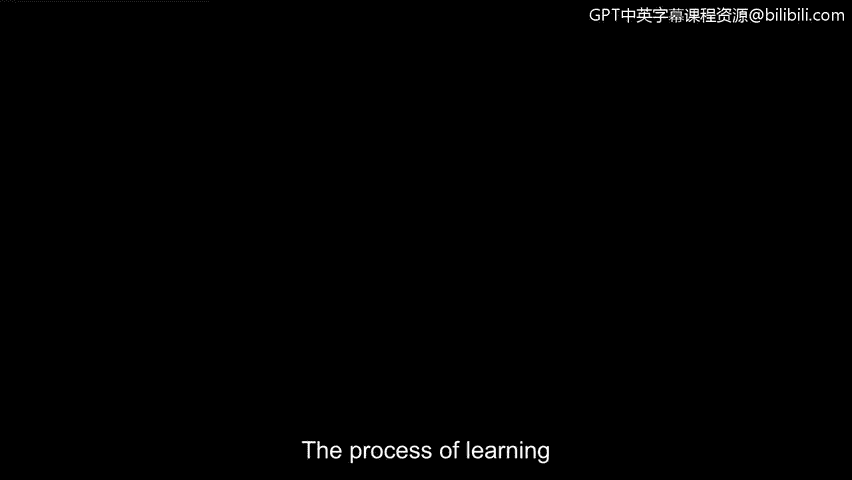
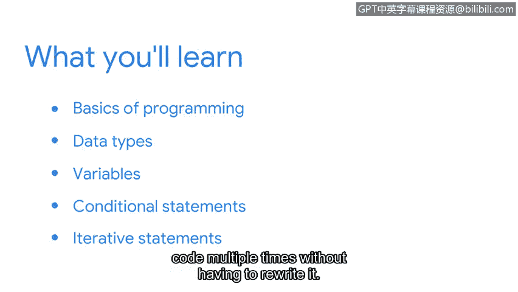

# 043：第一周导论

## 概述
在本节课中，我们将要学习编程语言的基础知识，特别是Python语言的核心组件。我们将从编程的基本概念开始，了解为什么Python在安全分析中被广泛使用，并逐步构建Python编程的基础。

学习一门新的编程语言与学习一门新的人类语言过程相似。例如，与任何人类语言一样，编程语言也由词汇构成。这些词汇被组织在一起，形成代码行。代码行用于与计算机进行通信，类似于一个句子，告诉计算机如何执行一项任务。

在本节中，我们将开始学习与计算机通信所需的语言，同时探索Python的一些关键组成部分。

## 课程内容
我们将从介绍编程的基础知识开始，首先探讨为什么安全分析师使用Python。

接下来，我们将开始构建Python的基础。我们将讨论数据类型，然后介绍变量。最后，我们将学习可以在Python中使用的特定语句，例如条件语句。条件语句帮助我们将逻辑融入程序中。

我们将学习的第二种语句是迭代语句。迭代语句允许我们多次重复一行代码，而无需重写它。

## Python对职业发展的帮助
学习Python帮助我在职业生涯中取得成功，因为使用Python使我能够从重复性任务中解放出时间，转而专注于更具挑战性的任务和问题。

成功应用自动化可以减少我的整体工作量，提高生产力，并降低人为错误的风险。自动化的使用还使我能够专注于需要更多创造力、协作和解决问题的工程任务。

## 总结
本节课中，我们一起学习了Python编程的入门知识，包括其基本概念、数据类型、变量以及条件语句和迭代语句。这些是构建自动化工具以支持网络安全任务的基础。你准备好开始用Python编程了吗？让我们开始吧。