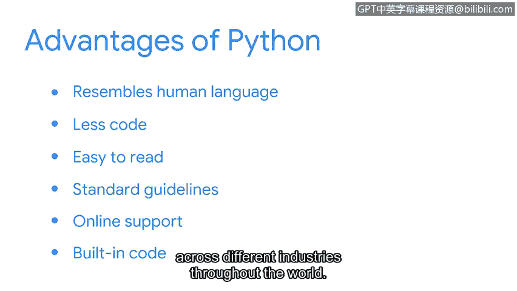

# 044：3_02_python-and-cybersecurity

## 概述 📋

在本节课中，我们将要学习编程在网络安全领域的应用，特别是Python语言如何被用来自动化安全任务。我们将探讨编程的基本概念、Python的特点以及它在安全分析中的具体用途。

---

## 编程与网络安全 🔐

安全专业人员会使用多种工具，其中一种就是计算机编程。

编程用于为计算机创建一套特定的指令，以执行任务。

我们可以用一个自动售货机来举例。将自动售货机视为一台向顾客提供食物或饮料的计算机。

为了获得商品，顾客需要向机器投入钱币，然后选择他们想要的商品。

假设顾客向机器提供了5美元。机器会存储这个数值。

同时，顾客进行选择。如果顾客选择了一个价值2美元的糖果棒。机器接收这个输入。

这个输入也被称为一条指令。然后，机器理解指令，输出价值2美元的糖果棒。

并找回3美元的零钱。世界上存在许多种编程语言。

这里我们将重点介绍Python。Python被认为是一种通用语言。

这意味着它可以创建各种不同的程序。

并且不专门针对任何特定问题。

在诸如网络开发和人工智能等领域。

Python通常用于构建网站和进行数据分析。在安全领域。

我们使用Python的主要原因是自动化我们的任务。

自动化是利用技术来减少执行常见和重复性任务所需的人工和手动劳动。

Python通常最适合自动化简短、简单的任务。例如。

处理安全事件的安全分析师可能有一份包含必要信息的日志。

手动阅读这些信息会花费太多时间，但Python可以帮助筛选这些信息。

这样分析师就能找到他们需要的东西。再举一个例子。

分析师可以使用Python来管理访问控制列表。

即控制谁可以访问系统及其资源的列表。

如果每次有员工离职，分析师都必须手动移除其访问权限，这可能会降低一致性。

然而，一个Python程序可以定期监控并自动执行此操作。

或者，Python也可以执行一些自动化任务，比如分析网络流量。

虽然这些任务可以通过外部应用程序完成，但使用Python同样可以实现。

除了自动化单个任务，Python还可以将独立的任务合并到一个工作流程中。

例如。想象一个操作手册指示分析师需要通过删除文件然后通知相关人员来解决某个情况。

Python可以将这些流程连接在一起。那么，安全专业人员究竟为何选择Python来完成这些任务呢？

Python作为一种编程语言具有几个优势。首先。

Python是用户友好的，因为它类似于人类语言。

它需要的代码更少，并且易于阅读。Python程序员还有一个好处，就是遵循标准指南，以确保代码设计和可读性的一致性。

学习Python的另一个重要原因是它有大量的在线支持。

Python还拥有一个庞大的内置代码库，我们可以导入并使用它来执行许多不同的任务。

这些只是Python在全球不同行业中持续保持高需求的部分原因。

在你的安全职业生涯中，你很可能会用到它。

---

## 总结 ✨

本节课中我们一起学习了编程在网络安全中的基础作用，特别是Python语言。我们了解到Python因其语法简洁、易于阅读、社区支持强大以及丰富的库，成为自动化安全任务（如日志分析、访问控制管理）的理想工具。它通过减少手动劳动和提高一致性，帮助安全分析师更高效地工作。

---

这些听起来都很棒。让我们稍作休息。接下来。

我们终于要开始运行一些Python代码了。我们下个视频再见。