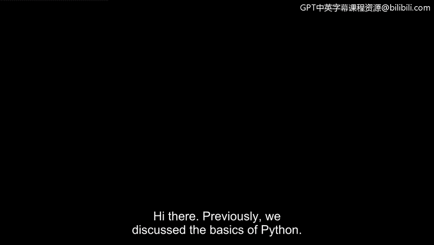
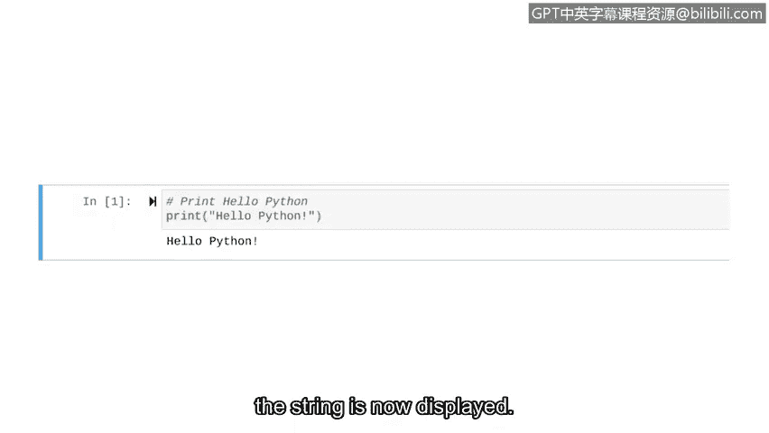

# 045：4_04 创建基础Python脚本



## 概述
在本节课中，我们将学习如何编写并运行一个基础的Python脚本。我们将从理解脚本与程序的区别开始，然后实践编写包含注释和`print`函数的代码，最后运行它。

## 脚本与程序的区别
上一节我们介绍了Python的基础知识，本节中我们来看看如何实际编写代码。在Python中，我们编写的代码通常被称为脚本或程序。两者之间存在细微差别。

我们可以将计算机程序比作一场戏剧表演。几乎每场戏剧表演都有一份书面剧本。演员研究并背诵剧本，以便向观众念出台词。然而，这并非表演的全部。整个表演还包括导演对灯光、服装和舞台布景等做出的决策。整个表演涉及许多设计选择，例如场景设计、灯光和服装。

创建这场演出的过程类似于Python编程的过程。编程涉及许多设计决策。但在Python中编写脚本的过程，更像是撰写演员将要念出的具体台词。

## 编写你的第一个Python脚本
理解了基本概念后，我们现在开始动手编写代码。在Python中，良好的实践是从注释开始。

**注释**是程序员为说明代码意图而做的笔记。我们现在添加一个注释。我们以井号`#`开头，表明这是一行注释，然后添加关于我们意图的细节。

```python
# 这行代码将在屏幕上打印“hello Python”
```

现在，让我们编写第一行Python代码。这段代码使用`print`函数。`print`函数将指定的对象输出到屏幕。在`print`之后，我们将要输出的内容放在括号内。在本例中，我们希望输出字符串“hello Python”。我们必须将字符串数据放在引号中。

```python
print("hello Python")
```

这些引号只是你在Python中会遇到的一种语法示例。**语法**指的是决定计算语言中何为正确结构的规则。

## 运行你的代码
代码编写完成后，我们需要运行它，以便计算机能够输出这个字符串。

以下是运行代码的步骤：
1.  打开你的Python环境（如IDLE、命令行或Jupyter Notebook）。
2.  输入或粘贴我们编写的两行代码。
3.  执行脚本。



你刚刚运行了你的第一行代码。由于我们的语法正确，字符串现在已显示在屏幕上。


## 总结
本节课中我们一起学习了Python脚本的基础。我们区分了脚本与程序的概念，实践了如何通过添加注释来说明代码意图，并使用`print("hello Python")`函数输出了第一个字符串。理解并正确使用语法是编写有效代码的关键。现在你已经体验了在Python中编写和运行代码，为学习其基本组件做好了准备。