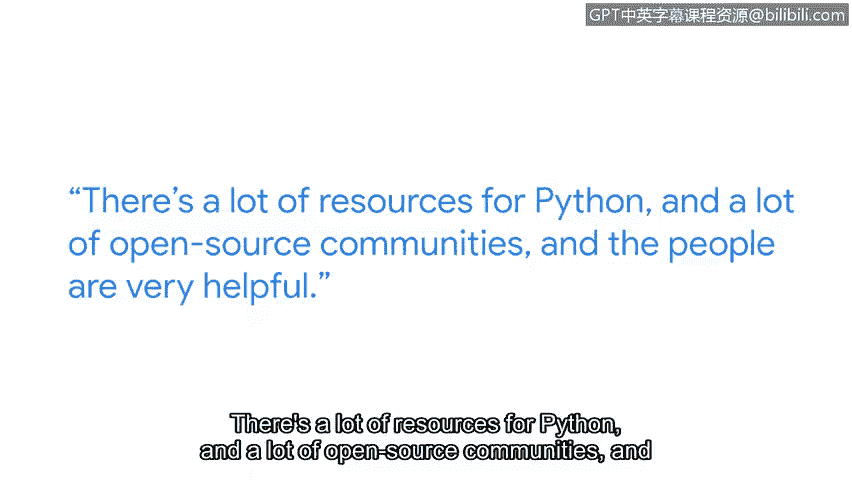

# 046：5_06_网络安全工程师与Python

在本节课中，我们将了解Python编程语言在网络安全领域的核心价值。我们将探讨网络安全工程师为何需要掌握Python，以及如何开始学习并应用它来解决实际问题。

## 🎯 概述：Python在网络安全中的重要性

我的名字是阿卡什，我在谷歌担任安全工程师。作为一名网络安全工程师，在你的职业生涯中，你最终会在大部分工作中使用Python。当你进入网络安全领域时，学习Python非常重要。

你将处理数以百万计的数据点，手动处理这些数据会非常困难。这时就需要Python来编写脚本和小程序，实现自动化，在瞬间完成同样的任务。

## 💡 学习Python的益处与体验

学习Python非常有趣。当你看到大约10行代码就能在一秒钟内处理数兆字节的数据时，会非常有成就感。

Python拥有大量资源和非常乐于助人的开源社区。保持好奇心，从小问题入手，亲自动手实践。不要害怕查阅语法，要善于利用在线资源学习。

## 🛡️ 网络安全工程师的职责与挑战

作为谷歌Chrome的安全工程师，我的工作是保护我们的客户免受外国政府和世界各地持续威胁的攻击。

威胁是无限的，没有界限。这正是网络安全令人兴奋的地方。

## 🚀 持之以恒，掌握核心技能

坚持下去。Python是一项基本技能，初期需要一些时间来培养，但它将在你的整个职业生涯中为你服务。

## 📝 总结

本节课中，我们一起学习了Python对于网络安全工程师的关键作用。我们了解到，Python能高效处理海量数据，实现任务自动化，是应对无限网络威胁的必备工具。通过利用丰富的资源和社区，从小处着手实践，你将能逐步掌握这项强大的技能，并在充满挑战与机遇的网络安全领域持续成长。