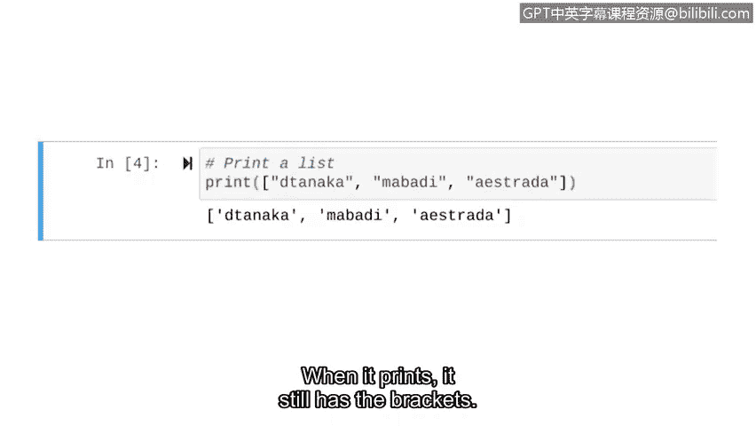

# 047：Python中的数据类型 📊


在本节课中，我们将要学习Python中如何对数据进行分类。理解数据类型是编写有效代码的基础，它决定了数据如何被存储、处理和操作。

## 概述

在编程中，数据类型就像厨房中对食材的分类。正如胡萝卜和辣椒属于蔬菜，鸡肉和牛肉属于肉类，不同的数据类型决定了我们如何处理它们。Python使用数据类型来定义数据的类别，这对于执行正确的操作至关重要。本节我们将介绍五种核心数据类型：字符串、整数、浮点数、布尔值和列表。

## 数据类型简介

上一节我们提到了编程中分类的重要性。本节中，我们来看看Python具体有哪些主要的数据类型。

**数据类型** 是为特定类型的数据项定义的类别。Python支持多种数据类型，我们将重点学习以下五种：
*   字符串
*   浮点数
*   整数
*   布尔值
*   列表

## 字符串（String）

当我们之前打印文本“Hello, Python”时，这就是一个字符串的例子。

**字符串** 数据是由有序字符序列组成的数据。这些字符可以是字母、符号、空格，甚至是数字。但需要注意的是，字符串类型中的数字不能用于数学计算。

所有字符串中的字符必须放在引号内。幸运的是，如果你忘记加引号，Python会通过给出错误信息来提示你。

让我们用之前的代码来探索一下，当我们漏掉引号时会发生什么。

```python
print(Hello, Python)
```

注意，字符串末尾缺少了一个引号。当我们运行这段代码时，会收到一个错误信息。

## 数值类型：浮点数与整数

Python同样支持数值数据类型。处理数值数据时，我们不需要在数据周围加引号。

数值数据包括浮点数和整数。

**浮点数** 是包含小数点的数字数据。这包括像 `2.1` 或 `10.5` 这样的分数，也包括带有小数点的整数，如 `2.0` 或 `10.0`。

**整数** 是不包含小数点的数字数据。像 `0`、`-9` 和 `5000` 这样的数字都是有效的整数。

到目前为止，我们使用 `print` 函数来输出字符串。但它也可以与浮点数和整数类型一起使用来进行计算。

让我们尝试一个例子。首先，按照良好实践，我们添加一个注释来解释代码的目的。

```python
# 计算 1 + 1 的结果
print(1 + 1)
```

输出结果给出了答案：1加1等于2。

我们可以将 `print` 与浮点数和整数数据一起使用，来执行各种数学运算，如加法、减法、乘法和除法。

## 布尔值（Boolean）

Python中的第三种数据类型称为布尔型。

**布尔** 数据是只能为两个值之一的数据，即 `True`（真）或 `False`（假）。布尔值在我们程序的逻辑中非常有用。

例如，让我们比较数字并确定这些比较的布尔值。首先，我们使用 `print` 函数来评估10是否小于5。然后，我们也将评估9是否小于12。

```python
print(10 < 5)
print(9 < 12)
```

那么你认为呢？10不小于5，但9小于12，对吧？让我们看看Python运行时如何处理。

第一行输出告诉我们，“10小于5”这个说法是**False**（假）。第二行告诉我们，“9小于12”这个说法是**True**（真）。当我们开始在代码中加入条件判断时，会更多地使用布尔值。

## 列表（List）

我们将要介绍的最后一个数据类型是列表。

**列表** 是一种数据结构，由按顺序排列的数据集合组成。我们将创建并打印一个列表，其中包含有权访问某个机密文件的三位用户的用户名。

首先，我们添加注释，说明意图是打印这个列表。在关键字 `print` 之后，我们添加列表。我们需要将列表放在方括号 `[]` 内。之后，我们将列表中的各个项目放在引号中，并用逗号分隔它们。



```python
# 打印有权访问文件的用户列表
print(["elarson", "bmoreno", "tshah"])
```

好的，现在运行它。正如预期，我们得到了列表。当它打印时，仍然包含方括号。

这只是列表功能的开始。随着你Python技能的增长，你将学习如何访问和编辑列表中的单个项目。

## 总结

本节课中我们一起学习了Python中五种主要的数据类型：**字符串**、**整数**、**浮点数**、**布尔值**和**列表**。这些数据类型是我们后续课程中会经常用到的一些更常见的类型。理解它们将帮助你更好地组织和处理程序中的数据。