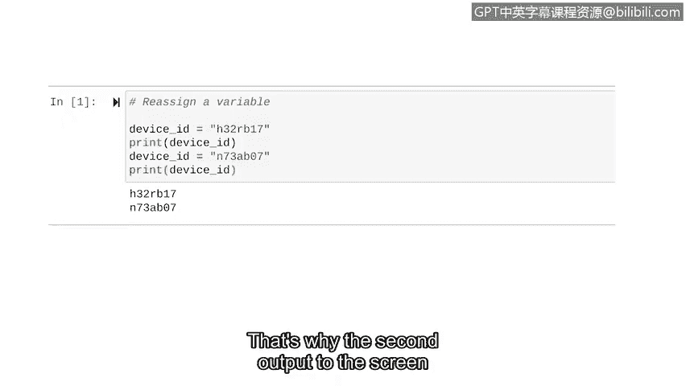

# 048：在Python中使用变量


## 概述
在本节课中，我们将要学习Python编程中的一个核心概念：变量。我们将了解什么是变量，如何创建和使用变量，以及变量在编写清晰、高效的代码中所扮演的重要角色。

---

## 变量：数据的容器
上一节我们介绍了不同的数据类型，就像烹饪中的食材分类。现在，我们来做一个新的比较。在厨房中，我们还会使用各种存储容器。这些容器可以存放许多不同的东西。一顿饭后，容器里可能装的是米饭；另一顿饭后，它可能装的是意大利面。类似地，在Python中，我们有**变量**。

一个**变量**是一个存储数据的容器。

以下是创建变量的步骤：
1.  为变量想一个名字。
2.  添加一个等号（`=`）。
3.  指定要存储在其中的对象。

创建变量通常被称为**赋值**。命名变量的最佳实践是让名字与其用途相关。

让我们用一个变量来存储一个设备ID。我们将变量命名为 `device_id`，使用等号（`=`），然后给它赋值 `"h32rb17"`。因为这个变量的数据类型是字符串，所以我们将该值放在引号中。

```python
device_id = "h32rb17"
```

运行这行代码后，我们的变量就被保存到Python中了。

---

## 调用变量
创建变量的目的是为了在后续的代码中使用它们。使用变量也可以被称为**调用**它们。要调用一个变量，只需输入它的名字。这会告诉Python使用该变量所包含的对象。

让我们在刚刚写的代码基础上添加一行，来调用这个变量。我们将让它打印出这个变量。为此，我们使用 `print()` 函数，并让它打印存储在 `device_id` 变量中的值。

```python
print(device_id)
```

在 `print()` 函数中使用变量时，我们**不使用**引号。这次当我们运行它时，有事情发生了：Python将 `h32rb17` 打印到了屏幕上。

---

## 变量与字符串的直接打印
我们再添加一行代码，来演示打印变量和直接打印字符串之间的区别。我们将让Python打印一个包含另一个设备ID的字符串：`"m50pi31"`。因为这是一个字符串数据而不是变量，所以我们把它放在引号里。

```python
print("m50pi31")
```

现在，运行代码并查看结果。它执行了两个打印语句。第一个读取变量并打印其包含的值 `h32rb17`。第二个读取指定的字符串并打印 `m50pi31`。

既然我们可以直接使用这个字符串，为什么还需要变量呢？原因如下：
*   我们经常使用变量来简化代码，使其更清晰、更易读。
*   如果我们需要一个非常长的字符串或数字，将其存储在变量中可以让我们在整个代码中使用它，而无需每次都完整地打出来。

---

## 变量的数据类型
在上一个例子中，变量存储的是字符串数据。但变量可以存储各种数据类型。**变量具有其当前存储对象的数据类型**。

如果你不确定变量内部存储的数据类型，可以使用 `type()` 函数。`type()` 函数是一个返回其输入参数数据类型的函数。

让我们在Python中使用 `type()` 函数。我们首先创建变量，然后添加一行包含 `type()` 函数的代码。这行代码要求Python告诉我们 `device_id` 变量的数据类型，并将结果赋值给一个名为 `data_type` 的新变量。之后，我们可以将 `data_type` 变量打印到屏幕上。

```python
device_id = "h32rb17"
data_type = type(device_id)
print(data_type)
```

运行后，Python告诉我们 `device_id` 包含的值是一个字符串（`<class 'str'>`）。

---

## 类型错误
在使用变量时，跟踪它们的数据类型非常重要。如果不这样做，可能会遇到**类型错误**。类型错误是由于使用了错误的数据类型而导致的错误。

例如，如果你尝试将一个数字和一个字符串相加，就会得到一个类型错误，因为Python无法将这两种数据类型组合在一起。它只能将两个字符串相加，或者将两个数字相加。

让我们演示一个类型错误。首先，我们将使用存储字符串值的 `device_id` 变量。然后，我们将定义另一个名为 `number` 的变量，并为其分配一个整数值。接着，我们写一个打印语句，输出这两个变量的和。

```python
device_id = "h32rb17"
number = 15
print(device_id + number)
```

运行这段代码，我们最终会得到一个错误，因为我们不能将字符串与数字相加。

---

## 重新赋值变量
前面我们提到变量就像容器，它们里面装的东西是可以改变的。在我们定义了一个变量之后，我们总是可以改变它内部的对象。这被称为**重新赋值**。

重新赋值一个变量与最初给它赋值非常相似。让我们尝试重新赋值一个变量。我们首先将相同的字符串 `"h32rb17"` 赋值给变量 `device_id`，并包含一行代码来打印这个变量。现在，让我们尝试重新赋值这个变量。我们输入变量的名字、一个等号，然后添加新的对象。在这个例子中，我们将使用字符串 `"n73abc07"` 作为新的设备ID。我们还会让Python再次打印这个变量。

```python
device_id = "h32rb17"
print(device_id)

device_id = "n73abc07"
print(device_id)
```



让我们看看运行这段代码会发生什么。Python打印了两行输出。第一个打印语句发生在重新赋值之前，所以它首先打印字符串 `h32rb17`。但第二个打印语句发生在它改变之后，这就是为什么屏幕上第二个输出是字符串 `n73abc07`。

通过这段代码，我们将一个具有字符串值的变量重新赋值为另一个字符串值。但是，也可以将一个变量重新赋值为另一种数据类型的值。例如，我们可以将一个具有字符串值的变量重新赋值为一个整数值。

---

## 总结
本节课中我们一起学习了Python中变量的核心概念。我们了解到变量是存储数据的容器，通过赋值来创建，通过变量名来调用。我们探讨了变量的数据类型以及因类型不匹配可能引发的类型错误。最后，我们学习了如何对变量进行重新赋值，这赋予了变量极大的灵活性。变量是Python中必不可少的部分，随着课程的深入，你会对它们越来越熟悉。