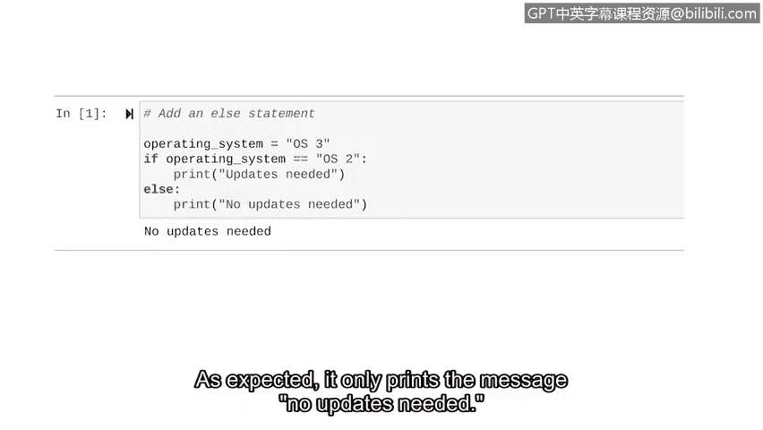

# 049：Python中的条件语句 🐍


在本节课中，我们将学习Python中条件语句的基础知识。条件语句是自动化任务的核心，它允许程序根据特定条件做出决策，从而执行不同的代码块。

## 概述

之前，我们讨论了如何在变量中存储不同的数据类型。现在，我们将开始进入自动化的概念，以便用代码创建令人兴奋的操作。

自动化是利用技术来减少执行常见和重复性任务所需的人工和手动劳动。它允许计算机为我们完成这些任务，从而让我们在生活中腾出更多时间去做其他活动。

条件语句对于自动化至关重要。

## 什么是条件语句？

条件语句是一种评估代码以确定其是否满足指定条件的语句。

关键字 `if` 在条件语句中非常重要。它用于开始一个条件语句。在这个关键字之后，我们指定必须满足的条件，以及如果满足条件将会发生什么。

我们每天都在使用 `if` 语句。例如，**如果**外面很冷，**那么**我们就穿夹克。或者**如果**下雨，**那么**我们就带伞。`if` 语句的结构包含我们想要评估的条件，以及如果条件满足时Python将执行的操作。

Python总是评估条件是**真**还是**假**。如果为真，它就执行特定的操作。

## `if` 语句详解

让我们探索一个例子。我们将指示Python在任何时候失败登录尝试次数大于5时，打印一条“账户已锁定”的消息。

```python
if failed_attempts > 5:
    print("Account locked")
```

我们的关键字 `if` 告诉Python开始一个条件语句。之后，我们指明要检查的条件。在本例中，我们检查用户是否有超过5次的失败登录尝试。请注意我们如何使用一个名为 `failed_attempts` 的变量。在我们完整的代码中，我们会在 `if` 语句之前为 `failed_attempts` 赋值。

在这个条件之后，我们总是放置一个冒号 `:`。这表示冒号后面的内容是我们希望在条件满足时发生的事情。在本例中，当用户的失败登录尝试超过5次时，它会打印一条消息“账户已锁定”。

在Python中，这条消息应该始终**缩进至少一个空格**，以便仅在条件为真时执行。通常，我们将第一行称为**头部**，而将条件满足时发生的操作称为**主体**。

## 条件运算符

这个条件是基于一个变量大于一个特定数字。但我们可以使用各种运算符来定义我们的条件。

以下是常用的比较运算符：
*   **大于**：`>`，检查一个值是否大于另一个值。
*   **小于**：`<`，检查一个值是否小于另一个值。
*   **大于或等于**：`>=`，检查一个值是否大于或等于另一个值。
*   **小于或等于**：`<=`，检查一个值是否小于或等于另一个值。
*   **等于**：`==`，在条件语句中比较两个对象是否相等。注意，这不是单个等号 `=`（赋值），而是双等号 `==`。
*   **不等于**：`!=`，检查两个对象是否不相等。

双等号 `==` 是条件语句中常用的一个重要运算符。它评估两个对象是否匹配。当它们匹配时，它赋予布尔值 `True`；当它们不匹配时，赋予 `False`。

感叹号后跟等号 `!=` 表示“不等于”的条件。这个“不等于”运算符评估两个对象是否不同。当它们不匹配时，它赋予布尔值 `True`；当它们匹配时，赋予 `False`。

## 使用 `==` 的示例

让我们更仔细地研究一个使用双等号的例子。我们将关注一个在特定操作系统运行时打印“需要更新”消息的示例。

```python
if operating_system == "OS2":
    print("Updates needed")
```

这里，我们创建了一个条件，用于检查设备的操作系统是否与标识该操作系统的特定字符串匹配。为此，我们需要在条件中使用双等号。当匹配时，我们的程序将打印一条消息“需要更新”。

变量 `operating_system` 在双等号的左边。字符串 `"OS2"` 在右边。如果条件评估为 `True`，它将执行下一行缩进的代码中的操作。在这里，如果操作系统是 `OS2`，它将打印“需要更新”。如果为 `False`，则不会打印该消息。

请注意这一行是如何缩进的。这告诉Python该任务依赖于 `if` 语句评估为 `True`。

现在，让我们编写包含此条件的代码并获取结果。

```python
# 首先，为操作系统变量赋值
operating_system = "OS2"

# 然后，编写条件语句
if operating_system == "OS2":
    print("Updates needed")
```

由于我们将 `operating_system` 变量设置为 `"OS2"`，所以 `print` 语句将会执行。运行此代码，正如预期的那样，它打印了“Updates needed”，因为分配给 `operating_system` 变量的值等于 `"OS2"`。

## 引入 `else` 语句

有时，我们希望条件语句在第一个条件不成立时执行另一组指令。在我们的例子中，“不成立”意味着设备运行的操作系统不是 `OS2`。这时我们需要将 `else` 关键字纳入我们的条件语句中。

`else` 位于一个代码段之前，该代码段仅当条件语句中所有先前的条件都评估为 `False` 时才执行。`else` 语句总是跟在 `if` 语句之后，并以冒号 `:` 结尾。

让我们使用之前的条件并为其添加一个 `else` 语句。

```python
operating_system = "OS3"  # 这次赋一个不同的值

if operating_system == "OS2":
    print("Updates needed")
else:
    print("No updates needed")
```

我们包含了相同的 `if` 语句。但这次，我们将 `operating_system` 变量设置为包含一个不同的操作系统 `"OS3"`。因为这不符合 `if` 语句条件中的值，所以“需要更新”的消息不会打印。但我们可以添加一个 `else` 语句，告诉它做其他事情。

我们输入 `else` 关键字，后跟一个冒号 `:`。然后我们缩进下一行，并告诉它打印一条“无需更新”的消息。

当我们运行这段代码时，它会在 `if` 语句之后处理 `else` 语句。由于我们的 `if` 语句将评估为 `False`，它就会继续执行 `else` 指令。运行代码，正如预期，它只打印了消息“No updates needed”。



## 总结

在本节课中，我们一起学习了Python中条件语句的基础知识。我们首先了解了自动化以及条件语句在其中的作用。然后，我们深入探讨了 `if` 语句的结构和工作原理，包括如何使用各种比较运算符（如 `>`、`<`、`==`、`!=`）来定义条件。最后，我们学习了如何使用 `else` 语句来处理条件不满足时的情况。掌握 `if` 和 `else` 的使用，可以让你将逻辑融入代码，这是实现自动化任务的关键一步。