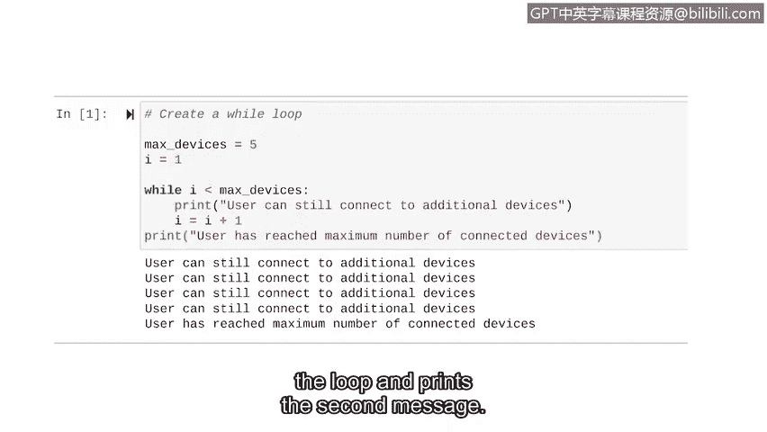
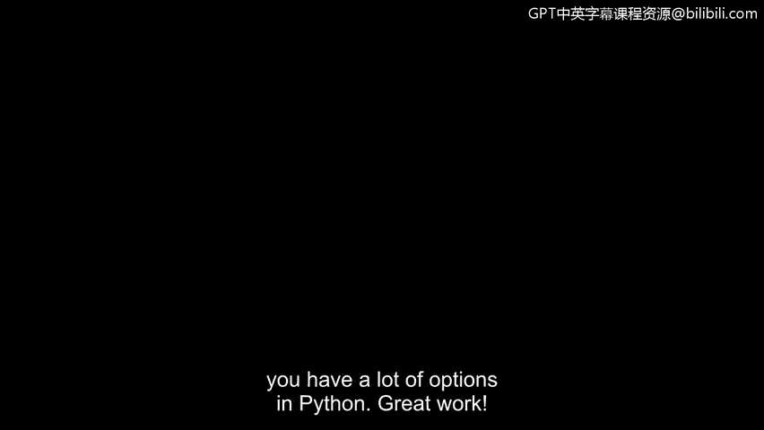

# 051：while循环详解


## 概述

在本节课中，我们将要学习Python中的另一种迭代语句——`while`循环。我们将了解它的基本结构、工作原理，并通过一个网络安全相关的实际例子来掌握其应用。

## 从for循环到while循环

上一节我们介绍了Python中的迭代语句，并重点讲解了`for`循环。迭代语句是指能够重复执行一组指令的代码。

本节中，我们来看看另一种迭代语句：`while`循环。当我们使用`for`循环时，代码是基于一个指定的序列来重复执行的。而`while`循环虽然也重复执行，但这种重复是基于一个条件的。只要条件为真，循环就会继续执行；当条件变为假时，`while`循环就会停止。

例如，这个`while`循环设置了一个条件：变量`time`必须小于或等于10。这意味着只要变量`time`不大于10，循环就会一直运行。

## while循环的结构

与`for`循环类似，`while`循环也有一个头部。它由关键字`while`、条件和一个冒号组成。

`while`循环以关键字`while`开始。关键字`while`标志着`while`循环的开始，后面跟着一个计算结果为布尔值（`True`或`False`）的条件。

条件中包含循环变量。这个变量用于控制循环的迭代次数。然而，`for`循环和`while`循环在变量使用上有一个重要区别：在`while`循环中，变量不是在循环语句本身内部创建的。在编写`while`循环之前，你需要先给变量赋值，然后才能在循环中引用它。

当包含循环变量的条件计算结果为`True`时，循环就会迭代。如果条件不为`True`，循环就会停止。在这个例子中，只要变量`time`小于或等于10，条件就会评估为`True`。最后，循环头部以一个冒号结束。

就像`for`循环一样，`while`循环有一个缩进的循环体，其中包含了循环迭代时要执行的操作。

## while循环的工作原理

这段代码的目的是打印一个代表时间的变量的值，并将其值增加2，直到它大于10。这意味着这个`while`循环的第一个操作是简单地打印当前`time`变量的值。

由于`while`循环不包含要遍历的序列，我们必须在`while`循环体中明确定义循环变量如何变化。例如，在这个`while`循环中，我们每次迭代都将循环变量`time`增加2。这是因为我们只想每两分钟打印一次时间。所以，这个`while`循环会打印出所有小于等于10的偶数。

## 网络安全应用实例：监控设备连接

现在我们已经了解了`while`循环的基础知识，让我们来探索一个实际例子。想象一下，我们对用户可以连接的设备数量有一个限制。我们可以使用`while`循环在用户达到最大连接设备数时打印一条消息。

以下是创建这个`while`循环的步骤：

1.  **初始化变量**：在开始`while`循环之前，我们需要为两个变量赋值。首先，我们将最大连接设备数`max_devices`设置为5。然后，我们设置循环变量`i`，并将其初始值设为1。与`for`循环不同，在`while`循环中，我们在循环外部设置这个变量。
2.  **创建循环头部**：接下来，我们创建`while`循环的头部。在这个例子中，条件是第一个变量`i`小于第二个变量`max_devices`。由于我们知道`max_devices`的值是5，我们可以理解这个循环将在`i`的当前值小于5时一直运行。
3.  **定义循环体**：然后，我们指明希望`while`循环做什么。因为这个循环在用户还能连接设备时运行，所以我们首先让它打印一条“用户仍可连接额外设备”的消息。在此之后，每次迭代，我们将`i`增加1。当循环重复时，它将使用`i`变量的新值。当`i`不再小于5时，Python将退出循环。
4.  **添加循环后操作**：我们还需要在循环退出时打印一条消息。我们停止缩进，因为下一个操作发生在循环外部。然后我们打印“用户已达到最大连接设备数”。

让我们运行这段代码。由于循环的作用，第一条消息总共打印了四次。当`i`的值增加到5时，循环停止。此时，它退出循环并打印第二条消息。

```python
# 示例代码
max_devices = 5
i = 1

while i < max_devices:
    print("用户仍可连接额外设备。")
    i += 1

print("用户已达到最大连接设备数。")
```



## 总结



本节课中，我们一起学习了Python中的`while`循环。我们了解了它的语法结构，即基于一个条件来重复执行代码块。我们探讨了它与`for`循环的关键区别：`while`循环的循环变量需要在循环外部初始化，并在循环体内手动更新。最后，我们通过一个限制用户连接设备数量的网络安全场景实例，实践了如何构建和应用`while`循环。当你将`for`循环和`while`循环的新知识与条件语句和变量等已有知识结合起来时，你在Python中就有了很多强大的工具可供选择。