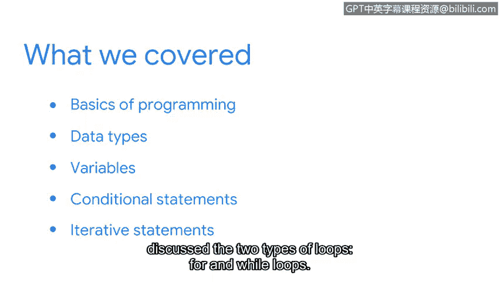

# 052：课程回顾


在本节课中，我们将回顾之前学习的关键Python编程概念，这些知识对于网络安全分析师至关重要。我们将总结编程基础、数据类型、变量、条件语句和循环语句的核心要点。

## 课程内容回顾

上一节我们探讨了迭代语句，现在让我们系统地回顾一下到目前为止所学的全部内容。

你首先学习了编程的基础知识，以及为什么编程是网络安全分析师非常重要的工具。你还学习了一些关于编程语言工作原理的基本概念。

接下来，我们学习了识别Python中的数据类型。我们重点介绍了以下几种：
*   **字符串**：用于表示文本，例如 `"警报"` 或 `"192.168.1.1"`。
*   **整数**：用于表示没有小数部分的数字，例如 `404` 或 `1024`。
*   **浮点数**：用于表示带有小数点的数字，例如 `3.14` 或 `99.5`。
*   **布尔值**：用于表示逻辑真或假，即 `True` 或 `False`。
*   **列表**：用于存储有序的元素集合，例如 `[‘GET’， ‘POST’， ‘PUT’]`。

然后，我们重点学习了如何使用变量。变量就像一个带标签的盒子，用于存储数据，你可以通过变量名来访问或修改其中的数据。例如：
```python
ip_address = "10.0.0.1"
status_code = 200
```
之后，你全面学习了条件语句，以及如何使用Python语句检查逻辑条件。`if`， `elif`， `else` 语句允许程序根据不同的条件执行不同的代码块。例如：
```python
if failed_login_attempts > 5:
    print("触发账户锁定警报")
else:
    print("登录尝试正常")
```
最后，我们学习了迭代语句，并讨论了两种类型的循环：`for` 循环和 `while` 循环。`for` 循环通常用于遍历序列（如列表），而 `while` 循环会一直执行，直到指定的条件不再为真。例如：
```python
# for循环示例
for log in suspicious_logs:
    analyze(log)

# while循环示例
while connection_active:
    monitor_traffic()
```

## 总结与展望



本节课中，我们一起学习了Python编程的核心基础，包括其重要性、基本结构、数据类型、变量、条件判断和循环控制。这些是构建自动化安全脚本和分析工具的基石。

随着你在本课程中的深入以及在网络安全分析师职业生涯中的发展，你将不断运用这些知识。

在接下来的章节中，我们将探索Python的其他重要组成部分，包括函数。函数可以帮助你将代码组织成可重复使用的模块，让程序更加清晰和高效。