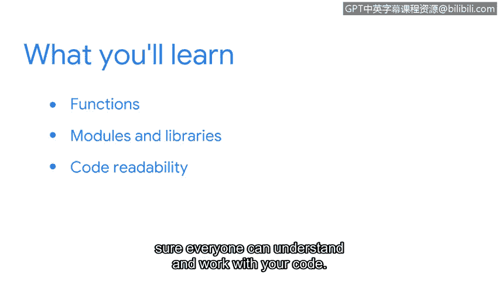

# 053：12_01_welcome-to-week-2

在本节课中，我们将继续学习Python编程，重点介绍如何编写更高效、更易读的脚本。我们将学习函数、模块和库，以及提升代码可读性的最佳实践。

欢迎回到我们的Python学习之旅。在之前的视频中，我们学习了Python的基础知识。我们从最初开始，了解了安全分析师如何使用Python。我们学习了Python的几个基础构建块，并详细学习了数据类型、变量和基本语句。

现在，我们将在此基础上继续学习，了解更多关于如何编写高效Python脚本的知识。我们将探索如何让我们的工作更有效率。

接下来的视频将首先介绍**函数**，这在Python中非常重要。函数允许我们将一组指令组合在一起，以便在代码中反复使用。

之后，我们将学习Python的**模块**和**库**。它们包含了我们可以与Python一起使用的函数和数据类型的集合。它们帮助我们获得函数功能，而无需我们自己创建。

最后，我们将讨论编程中最重要的规则之一，即**代码可读性**。我们将学习如何确保每个人都能理解并使用你的代码。

很高兴你决定继续和我一起学习Python。让我们开始学习更多内容吧。

---

本节课中，我们一起学习了本周的学习目标，包括函数、模块与库以及代码可读性。这些知识将帮助我们构建更强大、更易于维护的Python脚本，以自动化网络安全任务。