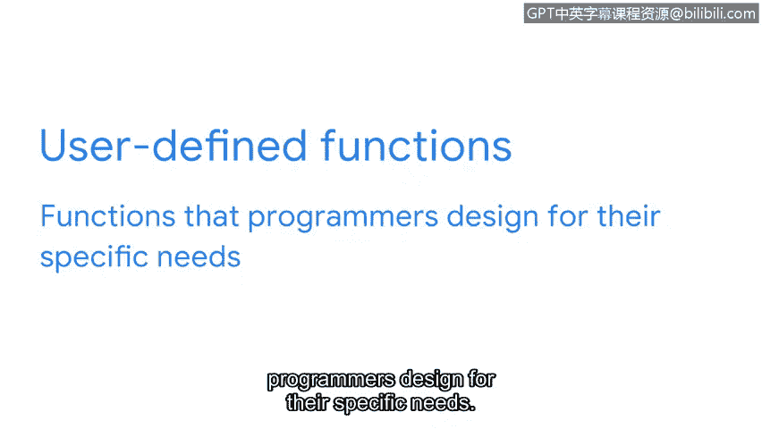

# 054：函数简介

在本节课中，我们将要学习Python编程中的一个核心概念——函数。我们将了解函数是什么、为什么它们如此重要，以及它们如何帮助我们编写更高效、更易于维护的代码。

## 概述：为什么需要函数？

随着程序复杂度的增加，我们很可能会重复使用相同的代码行。多次编写相同的代码会非常耗时。幸运的是，我们可以使用函数来管理这种情况。函数是程序中可以重复使用的一段代码。

## 函数是什么？

我们之前已经学习过一个函数：`print`函数。我们用它来将指定的数据输出到屏幕，例如，我们打印了 `print("hello Python")`。除了`print`，Python中还有许多其他函数。

有时，我们需要自动化一些如果手动操作会非常重复的任务。为了帮助理解，我们可以将Python的关键组件与厨房元素进行类比。

## 类比理解：厨房里的函数

之前，我们将**数据类型**比作不同类别的食物。处理蔬菜和处理肉的方式不同，同样，处理不同数据类型的方式也不同。

接着，我们讨论了**变量**，它们就像餐后存放食物的容器，里面装的东西可以改变。

至于**函数**，我们可以把它们想象成**洗碗机**。如果不使用洗碗机，你将花费大量时间单独清洗每一个盘子。但洗碗机自动化了这个过程，让你可以一次性清洗所有餐具。类似地，函数提高了编程效率。它们在程序中执行重复性的活动，使程序能够有效地工作。

## 函数的核心优势

函数在我们的程序中被设计为可重复使用。它们由一系列小指令组成，可以在程序中的任何地方被调用任意多次。

函数的另一个好处是，如果我们**需要修改**它们，我们可以直接在函数内部进行更改，这个更改会应用到所有使用该函数的地方。这远比在程序中的许多不同位置进行相同的修改要好得多。

## 函数的类型

`print`函数是**内置函数**的一个例子。内置函数是Python中已经存在的函数，可以直接调用。它们默认就可供我们使用。

我们也可以创建**自定义函数**。自定义函数是程序员根据特定需求设计的函数。

## 总结：函数的价值

无论是内置函数还是自定义函数，都像是大程序中的**迷你程序**。它们让Python编程变得更加高效和有效。

在接下来的学习中，我们将继续深入探索函数的创建和使用方法。