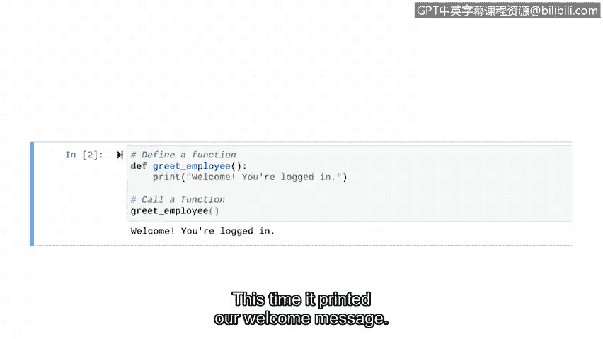

# 055：创建基础函数


在本节课中，我们将学习如何创建和运行一个非常简单的用户自定义函数。我们将从定义函数开始，然后调用它来执行特定任务。

## 定义函数

上一节我们介绍了函数的概念，本节中我们来看看如何具体定义一个函数。定义函数就是告诉Python这个函数的存在。为此，我们需要使用 `def` 关键字。

以下是定义一个函数的基本步骤：

1.  使用 `def` 关键字。
2.  为函数命名。
3.  在函数名后添加括号 `()`。
4.  在行末添加冒号 `:`。
5.  在缩进的代码块中编写函数要执行的操作。

让我们创建一个在员工登录后向其问候的函数。首先，我们通过注释说明代码的意图。

```python
# 定义一个问候员工的函数
def greet_employee():
    print("欢迎登录！")
```

在这段代码中，`greet_employee` 是函数名。括号 `()` 目前是空的，因为我们这个简单的函数不需要接收任何外部信息。冒号 `:` 表示函数头的结束，而缩进的 `print` 语句是函数体，它定义了函数被调用时要执行的操作。

## 调用函数

仅仅定义函数并不会让它运行。要执行函数内的代码，我们必须调用它。调用函数就像使用Python内置的 `print()` 函数一样。

以下是调用函数的步骤：

1.  在函数定义之后，另起一行。
2.  直接写出函数名，并在后面加上括号 `()`。

让我们调用刚才定义的 `greet_employee` 函数。

```python
# 调用问候函数
greet_employee()
```



当我们运行包含定义和调用的完整代码时，控制台就会输出我们预设的欢迎消息。

## 总结


本节课中我们一起学习了如何创建和运行一个基础的Python函数。我们首先使用 `def` 关键字定义了一个名为 `greet_employee` 的函数，该函数在被调用时会打印一条欢迎信息。随后，我们通过写出函数名并加上括号 `()` 的方式调用了这个函数，从而成功执行了函数体内的代码。这是一个简单但完整的函数使用流程。