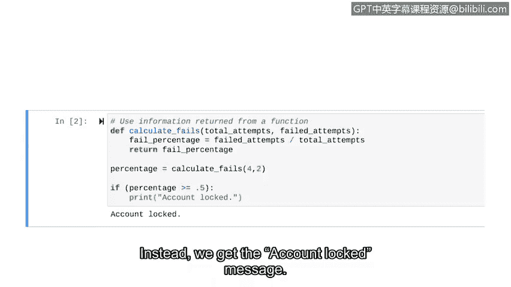

# 057：return语句

在本节课中，我们将要学习如何从函数中返回信息。我们将了解`return`语句的作用，并通过一个网络安全相关的实例——分析登录尝试失败率——来掌握其用法。

## 从函数中获取信息

上一节我们介绍了如何向函数传递参数。本节中我们来看看如何从函数中向外发送信息。

`return`语句允许我们实现这个功能。`return`语句是一条在函数内部执行的Python语句，它将信息发送回函数调用处。

对于安全分析师而言，从函数中返回信息的能力有多种用途。例如，分析师可能编写一个函数来检查某人是否有权访问特定文件，并向主程序返回一个布尔值`True`或`False`。

我们将探索另一个例子。让我们创建一个与分析登录尝试相关的函数。

## 创建计算失败率的函数

基于传入的信息，这个函数将计算登录失败的百分比，并返回这个百分比。程序可以多种方式使用这个信息，例如，用于决定是否锁定账户。

让我们开始学习如何从函数中返回信息。和之前一样，我们首先定义函数。

我们将它命名为`calc_fails`，并设置两个与登录尝试相关的参数：`total_attempts`（总尝试次数）和`failed_attempts`（失败次数）。

接下来，告诉Python我们希望这个函数做什么。我们希望这个函数将失败尝试的百分比存储在一个名为`failed_percentage`的变量中。

我们需要用失败次数除以总次数来得到这个百分比。到目前为止，这与我们之前学过的内容相似。

但现在，让我们学习如何返回`failed_percentage`。为此，我们需要使用关键字`return`。

`return`用于从函数中返回信息。在我们的例子中，我们将返回刚刚计算出的百分比。所以在关键字`return`之后，我们输入`failed_percentage`，这是包含此信息的变量。

现在，我们准备调用这个函数。我们将计算一个登录4次、失败2次的用户的失败百分比。

所以我们的参数是4和2。当我们运行它时，函数返回失败尝试的百分比，即0.5或50%。

## 处理函数的返回值

但在某些Python环境中，这个值可能不会直接打印到屏幕上。我们无法在函数外部使用特定的变量名`failed_percentage`。

因此，为了在程序的其他部分使用这个信息，我们需要从函数返回值并将其赋给一个新变量。

让我们来验证一下。这次，当函数被调用时，返回的值被存储在一个名为`percentage`的变量中。

然后我们可以在后续代码中使用这个变量。例如，我们可以编写一个条件判断，检查失败尝试的百分比是否大于或等于50%。

当条件满足时，我们可以让Python打印一条“账户已锁定”的消息。让我们运行这段代码。

这次，百分比没有直接返回到屏幕，取而代之的是我们得到了“账户已锁定”的消息。

接下来，我们将讨论更多关于函数的内容。但下一次，我们将介绍一些Python内置的、可以直接使用的函数。

## 总结

本节课中我们一起学习了`return`语句。我们了解到`return`语句用于从函数中向外发送信息，这对于编写模块化和可重用的代码至关重要。我们通过一个计算登录失败率的网络安全实例，实践了如何定义带`return`语句的函数，以及如何在调用函数时接收和使用其返回值。