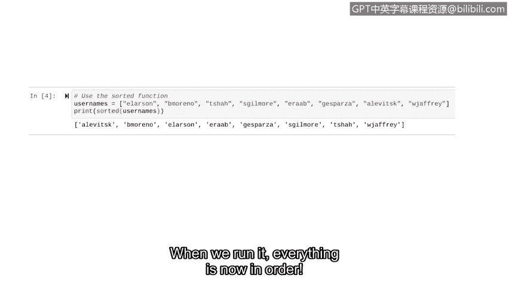

# 058：探索内置函数


在本节课中，我们将要学习Python的内置函数。我们将回顾一些已学过的函数，并探索几个新的内置函数，同时了解如何将它们组合使用。

## 概述

上一节我们介绍了如何创建自定义函数。本节中，我们来看看Python提供的一些内置函数。内置函数是Python自带的、可以直接调用的功能。我们的任务就是通过它们的名字来调用它们。

## 回顾已学内置函数

我们已经在本课程中描述过一些内置函数，例如 `print` 和 `type` 函数。在学习新函数之前，让我们快速回顾一下这两个。

*   **`print` 函数**：输出指定的对象到屏幕。
    *   代码示例：`print("Hello, World!")`
*   **`type` 函数**：返回其输入参数的数据类型。
    *   代码示例：`type(100)`

之前，我们一直是独立地使用这些函数。例如，我们让Python打印某些内容，或者让Python返回某些内容的数据类型。

## 函数的组合使用

随着我们开始深入学习函数，我们经常需要将多个函数组合在一起使用。我们可以通过将一个函数作为参数传递给另一个函数来实现这一点。

例如，在这行代码中：
```python
print(type("hello"))
```
Python首先返回 `"hello"` 的数据类型（一个字符串），然后这个返回值被传递给 `print` 函数。这意味着字符串的数据类型将被打印到屏幕上。

`print` 和 `type` 并不是唯一可以这样组合使用的函数。在所有情况下，通用语法是相同的：**先处理内层函数，然后将其返回值传递给外层函数**。

## 理解函数的输入与输出

使用函数时，你必须理解它们期望的输入和输出是什么。

*   有些函数只期望特定的数据类型，如果使用错误类型，会返回类型错误。
*   其他函数可能需要特定数量的参数，或者会返回不同的数据类型。

以下是关于函数输入输出的一些考虑：

*   **`print` 函数**：可以接受任何数据类型作为输入。它也可以接受任意数量的参数，即使这些参数具有不同的数据类型。
    *   代码示例：`print("The value is", 100, "points.")`
*   **`type` 函数**：可以接受所有数据类型，但它只接受一个参数。
    *   代码示例：`type(73.2)`

在使用内置函数之前，我们必须确切地知道它需要多少个参数、这些参数可以是哪些数据类型，以及它会产生什么样的输出。

## 探索新的内置函数

现在让我们学习几个新的内置函数，并思考它们的输入和输出。

### max 函数

`max` 函数返回传递给它的最大数值输入。它没有定义可接受参数的数量限制。

让我们探索一下 `max` 函数。我们将以变量的形式传递三个参数给 `max`。

首先定义变量：
```python
a = 3
b = 9
c = 6
```
然后，将这些变量传递给 `max` 函数并打印结果：
```python
print(max(a, b, c))
```
运行这段代码，它会告诉我们这些值中最高的是 `9`。

### sorted 函数

`sorted` 函数对列表中的元素进行排序。在处理列表时，这个函数在安全场景中非常有用。

*   对于数字列表，我们可能需要将它们从小到大（或从大到小）排序。
*   对于字符串数据列表，我们可能需要按字母顺序排序。

想象一下，你有一个包含组织中用户名的列表，并且你想按字母顺序对它们进行排序。让我们使用Python的 `sorted` 函数来实现。

首先，通过变量 `usernames` 指定我们的列表：
```python
usernames = ["bob", "alice", "charlie", "david"]
```
现在，使用 `sorted` 函数通过将 `usernames` 变量传递给它来对这些名称进行排序。然后，将其输出传递给 `print` 语句，以便显示在屏幕上。
```python
print(sorted(usernames))
```
运行它，所有名字现在都按顺序排列好了。



## 总结


本节课中我们一起学习了Python的内置函数。我们回顾了 `print` 和 `type` 函数，并学习了如何将函数组合使用。我们还探讨了理解函数输入和输出的重要性，并介绍了两个新的内置函数：用于查找最大值的 `max` 函数，以及用于对列表进行排序的 `sorted` 函数。这些只是可供你使用的众多内置函数中的一部分。随着你在Python中深入实践，你将熟悉更多有助于你编程的函数。