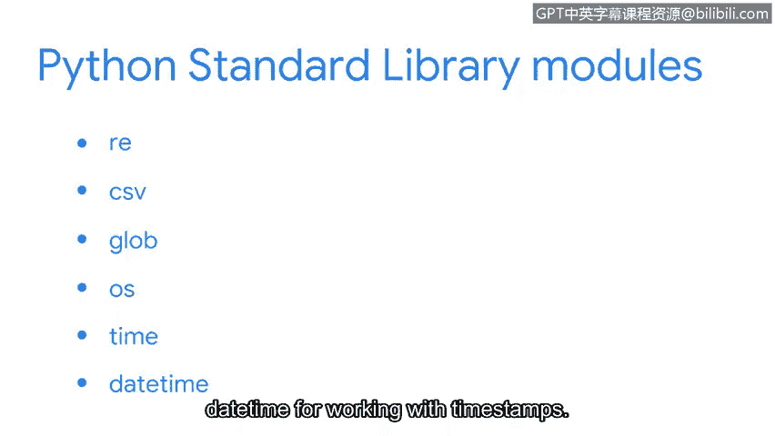

# 059：模块与库

## 概述
在本节课中，我们将要学习Python中的模块与库。我们将了解它们是什么、为什么有用，并探索Python标准库中的一些例子以及如何利用外部库来增强程序功能。

## 从内置函数到库
上一节我们介绍了如何在Python中构建函数。Python自带了许多内置函数，例如 `print`、`type`、`max` 等。

为了使用更多预先编写好的功能，你可以导入一个库。

## 什么是库与模块？
一个**库**是一个模块的集合，它为用户程序提供了可访问的代码。

所有的库通常由多个模块组成。

一个**模块**是一个Python文件，它包含额外的函数、变量、类以及任何种类的可运行代码。你可以把它们看作是包含了有用功能的已保存的Python文件。

模块可能由简单短小的代码行组成，也可能非常复杂和冗长。无论哪种方式，它们都能帮助程序员节省时间，并使代码更具可读性。

## Python标准库
现在，让我们具体关注Python标准库。Python标准库是一个广泛的可使用Python代码集合，通常随Python一起打包安装。

以下是Python标准库中的几个模块示例：

*   **`re` 模块**：这是一个对安全分析师非常有用的模块，当需要搜索日志文件中的模式时。
*   **`csv` 模块**：它允许你高效地处理CSV文件。
*   **`sys` 和 `os` 模块**：用于与命令行交互。
*   **`time` 和 `datetime` 模块**：用于处理时间戳。

这些只是Python标准库中的一小部分模块。

## 外部库
除了Python标准库中始终可用的内容，你还可以下载外部库。

以下是几个例子：

*   **`beautifulsoup4`**：用于解析HTML网站文件。
*   **`numpy`**：用于数组和数学计算。

这些库将协助你作为安全分析师进行网络流量分析、日志文件解析和复杂数学运算。

## 总结
本节课中我们一起学习了Python的模块与库。总的来说，Python库和模块非常有用，因为它们提供了预先编程好的函数和变量，这为用户节省了时间。我们鼓励你探索我们在这里讨论的一些库和模块，以及它们在你使用Python工作时可能对你有帮助的方式。