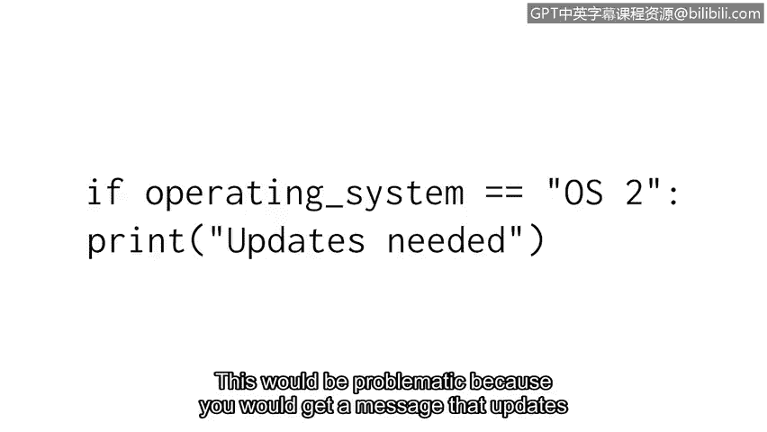

# 060：代码可读性


欢迎回来。使用Python编程的优势之一在于它是一种非常易读的语言。

Python社区共享的一套指南也有助于编写整洁、清晰的代码。

这些指南被称为风格指南。风格指南是一本指导文档编写、格式和设计的手册。

在编程领域，风格指南旨在帮助程序员遵循相似的规范。

PEP 8风格指南是为Python程序员提供的风格指南资源。

PEP是Python增强提案的缩写。PEP 8为程序员提供了与语法相关的建议。

这些建议并非强制性的，但它们有助于在程序员之间建立一致性，确保他人能轻松理解我们的代码。

其核心原则是：**代码被阅读的次数远多于被编写的次数**。

对于任何希望以与其他程序员一致的方式学习和格式化其Python代码的人来说，这都是一个极好的资源。

## 注释

上一节我们提到了风格指南的重要性，本节中我们来看看其中的具体建议。首先是注释。

注释是程序员对其代码意图所做的说明。它们被插入到计算机程序中，以指示代码在做什么以及为什么这样做。

PEP 8给出了具体的建议，例如使注释清晰，并在代码更改时保持注释更新。

以下是一个没有注释的代码示例。编写它的人可能知道发生了什么。

但其他需要阅读它的人呢？他们可能不理解`failed_attempts`变量背后的上下文，以及为什么当它大于5时会打印“account locked”。

此外，原始作者未来可能需要重新审视这段代码，例如，为了开发更大的程序。没有注释，他们的效率也会降低。

```python
failed_attempts = 6
if failed_attempts > 5:
    print("account locked")
```

但在下面这个例子中，我们添加了注释。其他读者可以快速理解我们的程序及其变量在做什么。

```python
# 检查登录失败尝试次数，超过5次则锁定账户
failed_attempts = 6
if failed_attempts > 5:
    print("account locked")
```

注释应该简短且切中要点。

## 缩进

接下来，我们来谈谈代码可读性的另一个重要方面：缩进。

缩进是在一行代码开头添加的空格。这既能提高可读性，又能确保代码正确执行。

在某些情况下，您必须缩进行代码，以建立与其他行代码的连接。

这些缩进的代码行组成一个代码块，并与前面未缩进的一行代码建立联系。

条件语句的主体就是一个例子。



```python
updates_needed = False
if updates_needed:
    print("System updates are needed.")
```

我们需要确保`print`语句仅在条件满足时执行。此处的缩进向Python提供了这个指令。

如果`print`语句没有缩进，Python将在条件语句之外执行它，导致它总是被打印。

```python
updates_needed = False
if updates_needed:
print("System updates are needed.")  # 错误：缺少缩进
```

这将导致问题，因为即使不需要更新，您也会收到需要更新的消息。

要进行缩进，您必须在一行代码前添加至少一个空格。通常，程序员会添加两到四个空格以获得清晰的视觉效果。PEP 8指南建议使用四个空格。

## 风格指南的重要性

在我的第一份工程工作中，我编写了一个脚本来帮助验证和启动防火墙规则。起初，我的脚本运行良好，但一年后当我们试图扩展其功能时，它变得难以阅读。

在那一年里，我的编程知识和编码风格，以及我队友的编码实践都发生了变化。当时我们的组织没有使用编码风格指南，因此我们的代码风格迥异，难以阅读且不易扩展。

这带来了很多挑战，并需要额外的工作来修复。确保代码可读且能够随时间修改，这就是为什么安全专业人员遵循编码风格指南很重要，也是为什么风格指南对组织来说如此重要。

## 总结

在本节课中，我们一起学习了Python代码可读性的关键要素。我们了解了PEP 8风格指南的作用，探讨了如何编写清晰的注释来阐明代码意图，并掌握了使用正确缩进来组织代码结构的重要性。编写可读的代码是使用Python工作的关键能力。

随着我们进入课程的下一部分，我们将继续培养有效的编码实践，以进一步提升代码的可读性。