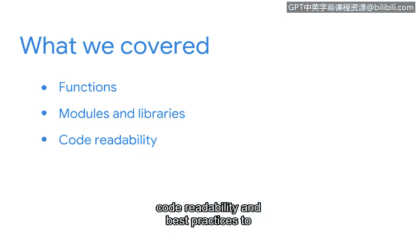

# 062：课程总结

在本节课中，我们将回顾并总结在Python课程中学到的核心概念，包括函数、模块与库，以及代码可读性与最佳实践。这些知识是使用Python高效自动化任务的基础。

## 函数的作用 🧩

上一节我们介绍了课程的整体目标，本节中我们来看看第一个核心概念：函数。

函数在Python中扮演着重要角色，它们能节省大量时间。我们学习了如何构建函数，以及如何开发自定义函数来满足特定需求。

*   **核心作用**：通过封装可重复使用的代码块来提升效率。
*   **自定义函数**：使用 `def` 关键字定义，例如 `def my_function(parameter):`。

## 模块与库 📚

理解了函数的基础后，我们可以进一步扩展工具集。本节将介绍模块与库。

模块和库为我们提供了远超Python内置功能的函数集合。通过导入它们，我们可以直接使用许多强大的工具。

以下是关于模块与库的关键点：
*   **模块**：一个包含Python定义和语句的文件（`.py`文件）。
*   **库**：通常是相关模块的集合。
*   **导入方法**：使用 `import` 语句，例如 `import os` 或 `from datetime import datetime`。

## 代码可读性与最佳实践 ✨

掌握了扩展功能的方法后，编写易于理解和维护的代码同样重要。本节将关注代码可读性与最佳实践。

我们学习了编写整洁、易懂代码的最佳实践。这包括使用有意义的变量名、添加注释以及遵循一致的代码风格（如PEP 8）。

*   **目标**：编写不仅自己能懂，他人也能轻松阅读和维护的代码。
*   **实践建议**：使用描述性变量名、编写文档字符串（`"""`）、保持一致的缩进。

## 总结与展望 🚀

本节课中我们一起回顾了Python中的几个关键概念：函数的基础与自定义、通过模块与库扩展功能，以及编写清晰代码的最佳实践。

基于这些理解，你已经为学习Python在任务自动化方面的强大能力做好了准备。这些技能将帮助你作为一名安全分析师继续前进。

感谢你花时间学习本课程。我们下一个视频再见。😊