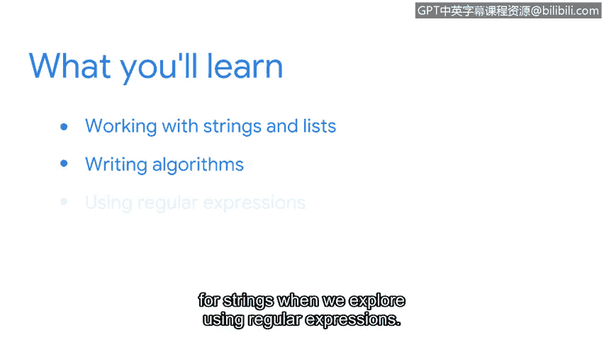

# 063：欢迎来到第三周 😊

在本节课中，我们将学习如何更有效地处理网络安全工作中的数据。作为安全分析师，您将处理大量数据。能够开发管理这些数据的解决方案至关重要。我们将要学习的Python知识将对此大有裨益。

上一节中，我们为本章节的学习打下了基础。我们学习了数据类型和变量，也涵盖了条件语句和循环语句。我们还学习了如何构建函数，甚至创建了自己的函数。

本节中，我们将在几个方面深化这些知识。首先，您将学习更多关于处理字符串和列表的方法。我们将扩展您处理这些数据类型的方式，包括从字符串中提取字符或从列表中提取项目。

我们的下一个重点是编写算法。您将学习一套可以在Python中应用的规则，以解决与安全相关的问题。

最后，在探索使用正则表达式时，我们将进一步扩展搜索字符串的方法。

我们将有很多乐趣，并开始编写一些非常有趣的Python代码。😊 让我们立刻开始吧。

---

本节课中，我们一起学习了第三周的学习目标和内容概览。我们了解到，本周将重点深化字符串和列表的操作，学习编写算法来解决安全问题，并探索强大的正则表达式工具。这些技能将帮助我们更高效地处理和分析安全数据。